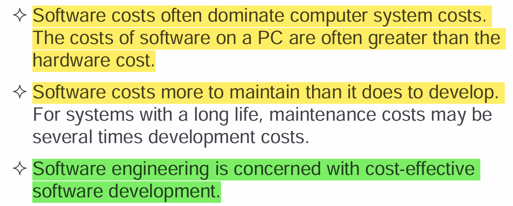
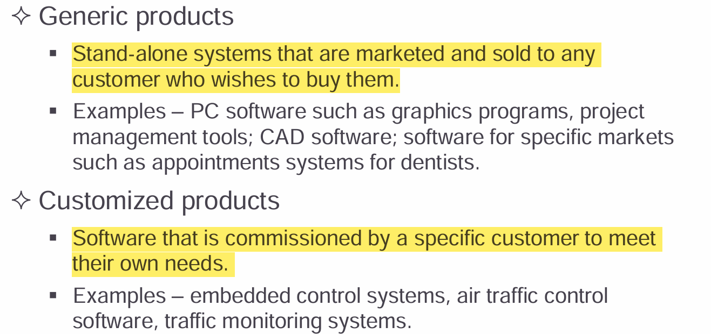
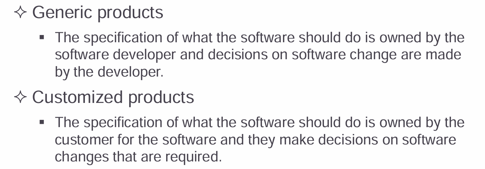
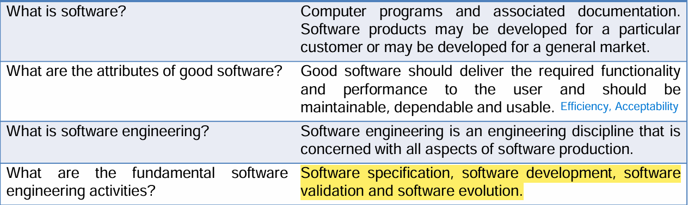
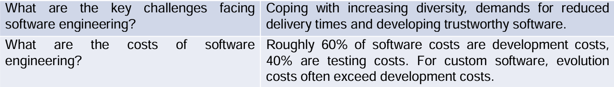
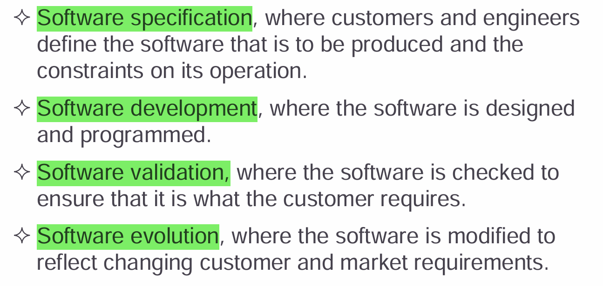
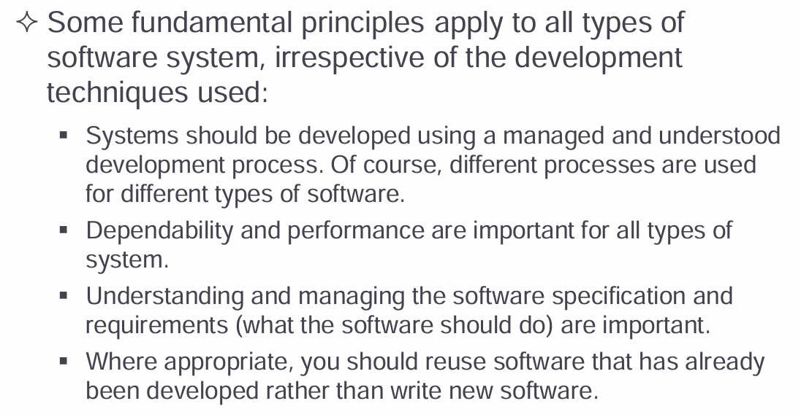
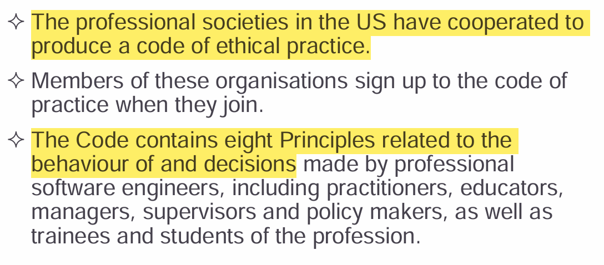
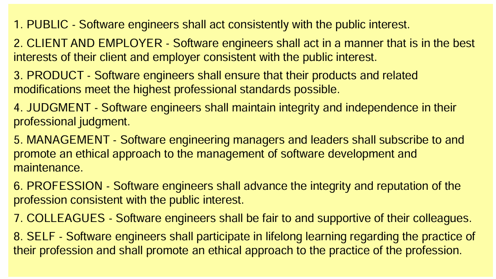

# <u>Introduction</u>

<mark>***\*Software\**** is a program or set of programs containing instructions that provide the desired functionality. ***\*Engineering***\* is the process of designing and building something that serves a particular purpose and finds a cost-effective solution to problems.</mark>

<mark>***\*Software Engineering\**** is the process of designing, developing, testing, and maintaining software. It is a systematic and disciplined approach to software development that aims to create high-quality, reliable, and maintainable software.</mark>

## <u>Software Costs</u>

## <u>Software Products and Specification</u>

## <u>Frequently Asked Questions</u>

## <u>Key Attributes of a good Software</u>

1. **Maintainability** 
   - Software should be written in such a way so that it can evolve to meet the changing needs of customers.
   - This is a critical attribute because software change is an inevitable requirement of a changing business environment.
2. **Dependability and  security** 
   - Software dependability includes a range of characteristics including reliability, security and safety.
   - Dependable software should not cause physical or economic damage in the event of system failure.
   - Malicious users should not be able to access or damage the system. 
3. **Efficiency**
   - Software should not make wasteful use of system resources such as memory and processor cycles.
   - Efficiency therefore includes responsiveness, processing time, memory utilization, etc.
4.  **Acceptability**
   - Software must be acceptable to the type of users for which it is designed.
   - This means that it must be understandable, usable and compatible with other systems that they use.

## <u>Software Process Activities</u>

## <u>General Issues Affecting Most Software</u>

1. **Heterogeneity** – Modern software must work across diverse environments, including distributed systems, various networks, and different devices (computers, mobile, IoT).
2. **Business & Social Change** – Rapid technological advancements and evolving business needs demand frequent software updates and fast development of new applications.
3. **Security & Trust** – As software integrates deeply into daily life, ensuring security, data privacy, and reliability is critical for user trust.

## <u>Application types</u>

1. **Stand-alone Applications**
   - Run on a local computer without requiring network access.
   - **Examples**: Microsoft Word, Adobe Photoshop, Media Players.
2. **Interactive Transaction-Based Applications**
   - Run on remote servers and are accessed by users via terminals or web browsers.
   - **Examples**: Amazon (e-commerce), Online Banking Portals, Social Media Apps.
3. **Embedded Control Systems**
   - Software that controls hardware devices, often in real-time.
   - **Examples**: Automotive engine control units (ECUs), Smart Home Devices, Industrial Robots.
4. **Batch Processing Systems**
   - Process large amounts of data at once, often in the background.
   - **Examples**: Payroll Processing Systems, Bank Statement Generation, Data Warehousing Jobs.
5. **Entertainment Systems**
   - Designed for leisure and user engagement.
   - **Examples**: Video Games (PlayStation, Xbox), Streaming Services (Netflix, Spotify).
6. **Systems for Modeling and Simulation**
   - Used by scientists and engineers to simulate real-world scenarios.
   - **Examples**: Weather Prediction Software, Flight Simulators, Traffic Flow Simulations.
7. **Data Collection Systems**
   - Gather and transmit environmental data using sensors.
   - **Examples**: IoT Weather Monitoring Systems, Industrial Sensors, Smart Meters.
8. **Systems of Systems**
   - Large-scale systems composed of multiple interacting software systems.
   - **Examples**: Smart Cities Infrastructure, Air Traffic Control Systems, Military Defense Systems.

## <u>Software engineering fundamentals</u>

## <u>**Web-Based Software Engineering**</u>

1. **Software Reuse** – Web-based systems are primarily built using pre-existing components, frameworks, and APIs to speed up development.
2. **Incremental Development** – Requirements evolve over time, making it impractical to define all features in advance. Agile methodologies are commonly used.
3. **UI Constraints** – Web interfaces depend on browser capabilities. Technologies like **AJAX** enable rich interactions, but simpler web forms with local scripting remain common.
4. **Complex Distributed Systems** – Web applications operate in distributed environments, requiring careful handling of scalability, security, and performance.
5. **Software Engineering Principles Apply** – Standard software engineering practices (modularity, testing, maintainability) are just as important in web-based systems as in traditional software.

## <u>Software engineering ethics</u>

- Software engineers must prioritize public safety, client interests, and product quality while maintaining confidentiality, fairness, and intellectual property rights.
- They should continuously improve their skills, ensure ethical decision-making, and consider the social and environmental impact of their work.
- Ethical software engineering fosters trust, security, and responsible technological advancement.

### <u>Issues of professional responsibility</u>

1. **Confidentiality** – Respect client and employer confidentiality, even without a formal agreement.
2. **Competence** – Only accept work within one's expertise and avoid misrepresenting skills.
3. **Intellectual Property Rights** – Follow laws on patents and copyrights, ensuring the protection of employer and client assets.
4. **Computer Misuse** – Avoid unethical activities, from minor misuse (e.g., playing games at work) to serious offenses (e.g., spreading viruses).

### <u>ACM/IEEE Code of Ethics</u>

### <u>Ethical dilemmas</u>

Ethical dilemmas arise when software engineers face conflicting responsibilities or challenges in decision-making. Common dilemmas include:

1. **Privacy vs. Business Interests** – Should an engineer develop software that collects extensive user data for profit, even if it compromises privacy?
2. **Security vs. Accessibility** – Should strong security measures be implemented even if they make the system harder to use?
3. **Honesty vs. Employer Pressure** – Should an engineer report software defects that might delay product release?
4. **Intellectual Property vs. Open-Source Ethics** – Should proprietary code be reused in an open-source project without permission?
5. **Automation vs. Job Loss** – Should software that replaces human workers be developed, knowing it will cause unemployment?
6. **Government Compliance vs. Ethical Responsibility** – Should an engineer develop surveillance software for governments that could violate human rights?