# Software Processes

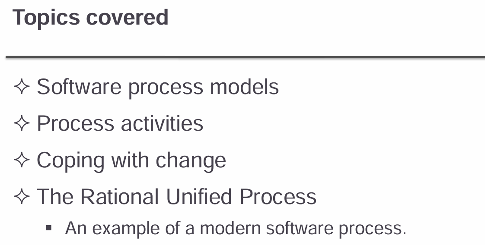

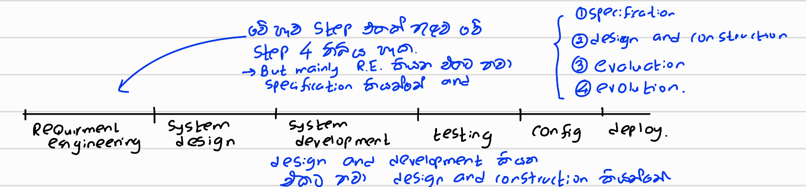

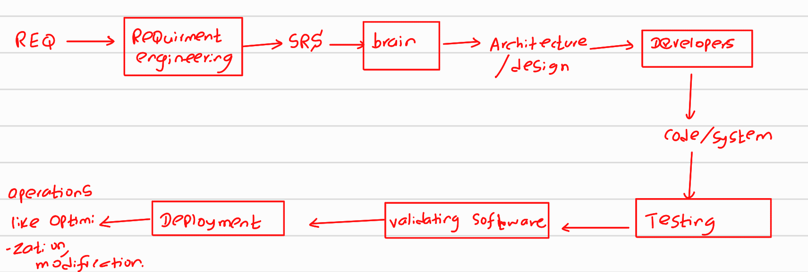

A **software process** is a structured set of activities required to develop a software system. While different processes exist, they all involve four main activities :

1. **Specification** – Defining what the system should do.
2. **Design and Implementation** – Organizing and developing the system.
3. **Validation** – Ensuring the system meets customer requirements.
4. **Evolution** – Modifying the system to meet changing needs.

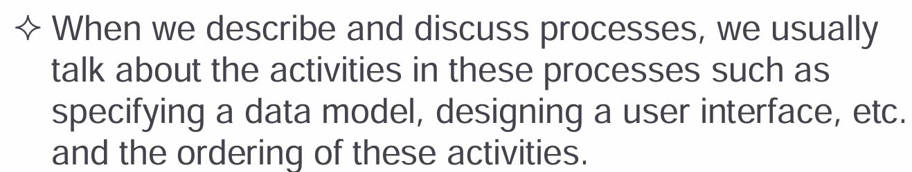

**Process Descriptions May Include:**

- **Products** – Outcomes of a process activity.
- **Roles** – Responsibilities of people involved.
- **Pre- and Post-conditions** – Statements that define the state before and after an activity or product is produced.

------

## (a) <u>**Types of Processes**</u>

### **Plan-Driven Processes**

- All process activities are planned **in advance**.

- Progress is measured **against a predefined plan**.

- Suitable for projects with well-defined requirements.

- 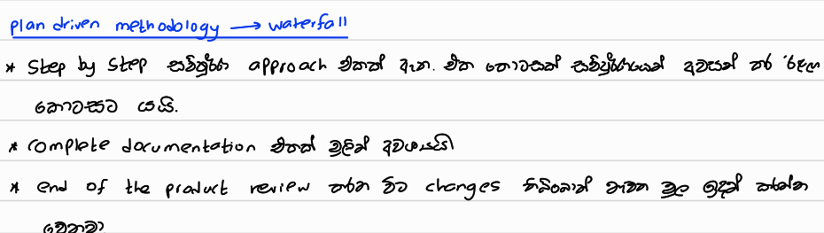

  

- | **Aspect**              | **Plan-Driven Development**                                  | **Waterfall Model**                                          |
  | ----------------------- | ------------------------------------------------------------ | ------------------------------------------------------------ |
  | **Definition**          | A general approach where all activities are planned in advance and progress is measured against the plan. | A specific type of plan-driven model with distinct, sequential phases. |
  | **Flexibility**         | Can allow some adjustments but remains rigid.                | Very rigid, requiring one phase to be completed before moving to the next. |
  | **Scope**               | Covers multiple software development models (e.g., Waterfall, V-Model). | A single, structured model following a strict phase-by-phase approach. |
  | **Requirement Changes** | Hard to accommodate, but some models allow slight flexibility. | Very difficult to incorporate changes after a phase is completed. |
  | **Examples**            | Waterfall, V-Model, Spiral (if planned in advance).          | Waterfall only.                                              |

###  **Agile Processes**

- **Planning is incremental**, allowing flexibility.
- Can adapt to **changing customer requirements**.
- Encourages iterative development and collaboration.

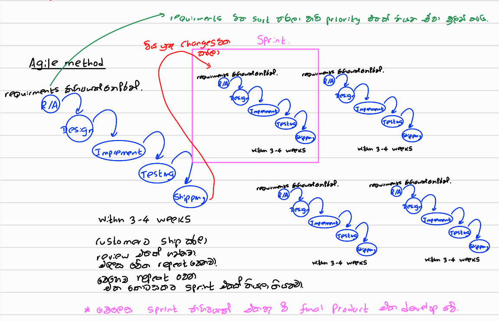

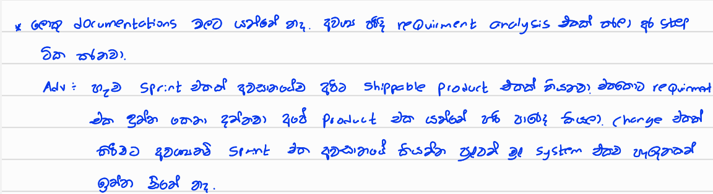

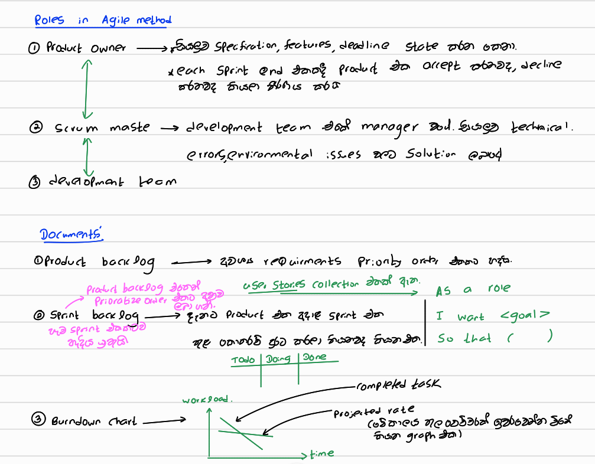

🔹 **Real-World Application:**
Most software projects **combine elements** of both plan-driven and agile approaches to balance structure and flexibility. **There is no universally right or wrong process**—the choice depends on project needs.

## (b) <u>**Software Process Models**</u>

A software process model is an abstract representation of a software process, describing it from a particular perspective.

1. **Waterfall Model** (Plan-driven)
   - Follows a structured, sequential approach with distinct phases.
2. **Incremental Development** (Plan-driven or Agile)
   - Development and validation occur in cycles, delivering small increments.
3. **Reuse-Oriented Software Engineering** (Plan-driven or Agile)
   - Software is built using existing components rather than developed from scratch.

🔹 **Most large systems incorporate elements of all these models** for efficiency and adaptability.

### 1. Waterfall Model

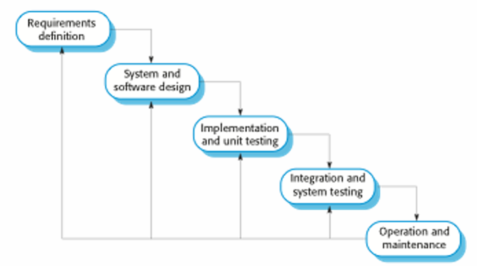

The **Waterfall Model** is a **plan-driven, sequential** approach to software development, where each phase is **completed before moving to the next**. It is best suited for projects with **well-defined requirements** and **limited changes**.

#### **Phases of the Waterfall Model**

1. **Requirements Analysis and Definition**
   - Gather and document user and system requirements.
   - Define functional and non-functional specifications.
2. **System and Software Design**
   - Architectural design of the system.
   - Detailed software design for implementation.
3. **Implementation and Unit Testing**
   - Developers write and test individual components (unit testing).
4. **Integration and System Testing**
   - Combine modules and test the full system for defects.
   - Validate system against requirements.
5. **Operation and Maintenance**
   - Deploy the software for users.
   - Fix bugs and enhance functionality over time.

------

#### **Problems with the Waterfall Model**

**1. Difficulty Accommodating Change**

- **Rigid structure**: A phase must be **completed before moving forward**.
- **Change is costly**: Modifications require **revisiting previous phases**.

**2. Not Suitable for Evolving Requirements**

- Works best when requirements are **fixed from the beginning**.
- Most business systems require **frequent adjustments**.

**3. Limited Flexibility**

- **Customer feedback is delayed** until late in the process.
- **Issues detected during testing** may require **major rework**.

------

#### **When to Use the Waterfall Model?**

✔ **Large-scale engineering projects** that require **strict documentation** and **multi-site coordination**.
✔ Projects with **well-understood, stable requirements**.
✔ Systems requiring **extensive compliance and regulatory approvals**.

✖ **Not ideal for modern, fast-changing business environments** where **iterative development** (like Agile) is preferred.

------

### 2. **Incremental Development** (Plan-driven or Agile)

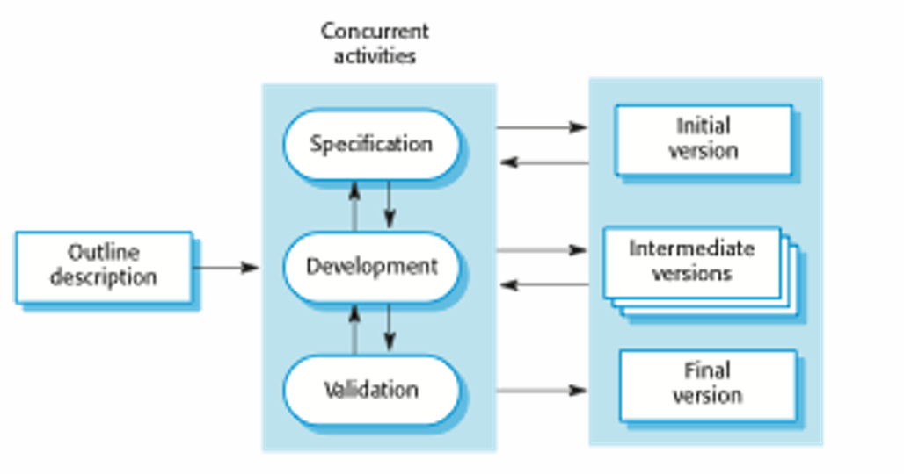

**Incremental development** is a **flexible** approach where the system is **developed in small, functional increments** instead of being built all at once. Each increment **adds new features**, allowing customer feedback and adaptations throughout the process. It can be **plan-driven** or **agile** depending on how structured the planning is.

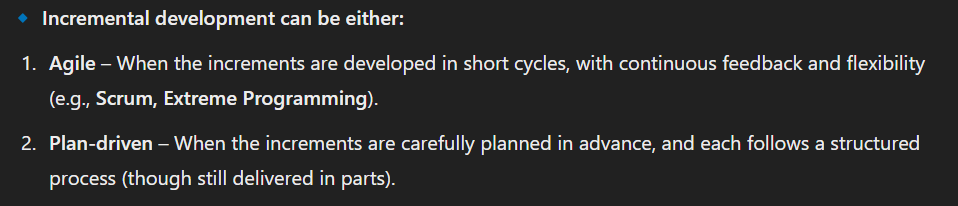

------

#### **Benefits of Incremental Development**

**1. Easier to Accommodate Changing Requirements**

- Since development happens in **small increments**, making changes is **less costly** than in the **Waterfall Model**.
- **Less rework** is needed because **only part of the system is affected** at a time.

**2. Improved Customer Feedback**

- Customers can **interact with working versions** of the software earlier.
- Feedback can be incorporated **before the final system is complete**, reducing misunderstandings.

**3. Faster Delivery and Deployment**

- **Usable parts of the system** are delivered sooner, so customers can **gain value early**.
- Businesses can start using **basic features** while additional functionalities are being developed.

------

#### **Problems of Incremental Development**

**1. Lack of Visibility for Managers**

- Since there is **no fixed schedule** for all deliverables, progress is **harder to measure**.
- **Frequent changes** make it difficult to maintain **detailed documentation** for every version.

**2. System Structure Degradation**

- As more increments are added, **the system may become disorganized**.
- Without **refactoring and proper design maintenance**, integrating new changes **becomes harder and more expensive**.

------

#### **When to Use Incremental Development?**

✔ When **customer feedback is important** throughout development.
 ✔ When **requirements are likely to change** over time.
 ✔ When **early deployment** of functional software is needed.

✖ Not ideal for **projects that require strict planning, documentation, or a well-defined system structure** from the start (e.g., safety-critical systems).

------

### 3. Reuse-Oriented Software Engineering

**Reuse-oriented software engineering** focuses on creating systems by **integrating existing components** rather than building everything from scratch. This approach leverages **commercial-off-the-shelf (COTS) systems** and **pre-developed components** to save time, reduce costs, and improve reliability.

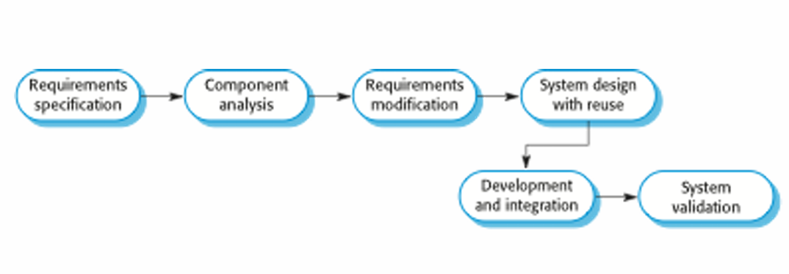

#### **Process Stages**

1. **Component Analysis**
   - Identifying and evaluating available components or systems that meet requirements.
2. **Requirements Modification**
   - Adapting the system's requirements to fit the capabilities of the reusable components.
3. **System Design with Reuse**
   - Designing the system to integrate the selected components.
4. **Development and Integration**
   - Integrating reusable components into the overall system and adapting them as needed.

------

#### **Types of Software Components**

1. **Web Services**
   - **Developed according to service standards** (e.g., RESTful or SOAP).
   - Available for **remote invocation** over the internet or intranet.
   - Example: **APIs** that provide functionality like payment processing or user authentication.
2. **Collections of Objects**
   - **Pre-built packages of objects** developed for specific frameworks (e.g., **.NET** or **J2EE**).
   - These packages can be easily integrated into applications within the given framework.
3. **COTS (Commercial-Off-The-Shelf) Software**
   - **Stand-alone software systems** that are ready-made for commercial use.
   - Configured for use in a particular environment or business.
   - Example: **ERP systems** like SAP, or CRM systems like Salesforce.

------

#### **Why Reuse-Oriented Software Engineering?**

- **Faster development**: Reusing pre-built components speeds up the development process.
- **Cost-effective**: Reduces the need for custom development.
- **Reliability**: COTS and reused components are often more reliable, as they have been tested and used by others.

In practice, **reuse is now the standard** for many business system development projects, especially in large-scale systems or enterprise applications.

------

Now Let's talk about main 4 steps in Software process,

In **real software processes**, activities are typically **interleaved**, involving technical, collaborative, and managerial efforts to create, test, and maintain software systems. These activities are not always linear but are integrated throughout the process.

## (c) <u>**Four Basic Process Activities**</u>

1. **Specification**
   - **Defining the system's requirements**—what the software should do.
   - Involves close collaboration with stakeholders to gather needs.
2. **Development**
   - The **design and implementation** of the system.
   - This is where the system is created based on the requirements.
3. **Validation**
   - Ensuring the software **meets customer needs** and **performs as expected**.
   - Involves **testing**, debugging, and gathering feedback.
4. **Evolution**
   - Modifying and **updating the software** to address changing needs.
   - This phase involves ongoing support and maintenance.

**How These Activities Are Organized in Different Models**

- **Waterfall Model**:
  - The four activities (specification, development, validation, evolution) are organized **in sequence**.
  - Each phase is completed **before moving to the next**.
- **Incremental Development**:
  - Activities are **interleaved**, meaning that the system is developed in **small increments**, with each cycle involving parts of **specification, development, validation**, and **evolution**.
  - This allows for **early delivery**, customer feedback, and easier adaptation to changes.

------

#### 1. <u>Software specification</u>

**Software specification** is the process of defining what a software system should do and the constraints it must operate under. It establishes clear **requirements** that guide the development process, ensuring that the system meets user needs and works within operational constraints.

**Requirements Engineering Process**

The **requirements engineering process** typically involves several stages, each focusing on different aspects of understanding, defining, and validating system requirements:

1. **Feasibility Study**

   - **Is the system technically and financially feasible to build?**
   - This stage evaluates whether the project can be realistically completed within the given constraints (e.g., time, cost, technology).

2. **Requirements Elicitation and Analysis**

   Elicitation : the process of getting information or a reaction from someone

   - **What do system stakeholders require or expect from the system?**
   - Involves gathering requirements from users, customers, and other stakeholders.
   - Stakeholders may include end users, business managers, technical staff, and external systems.

3. **Requirements Specification**

   - **Defining the requirements in detail.**
   - This step involves **documenting** the requirements clearly and precisely, often creating a **Software Requirements Specification (SRS)** document that outlines functional, non-functional, and performance requirements.

4. **Requirements Validation**

   - **Checking the validity of the requirements.**
   - Ensures that the defined requirements are correct, complete, and feasible.
   - Validation may involve stakeholder reviews, inspections, and testing against the **feasibility** study to ensure alignment with technical and financial constraints.

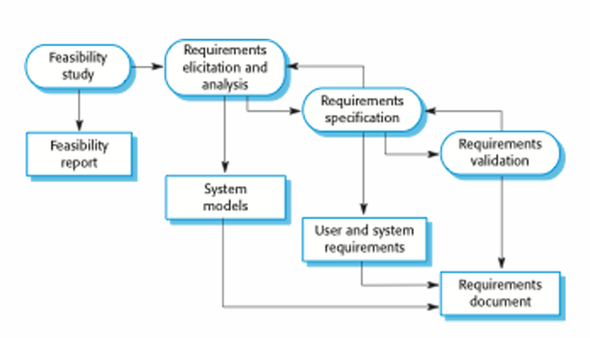

**Why is Software Specification Important?**

- Ensures that all stakeholders have a **shared understanding** of the system.
- **Minimizes misunderstandings** and **miscommunication** between stakeholders and developers.
- Provides a **clear foundation** for designing, developing, and testing the system.
- Helps to avoid **scope creep** (when requirements are added without proper control).

------

#### 2. <u>Software design and implementation</u>

The goal of **software design and implementation** is to **convert the system specification** (what the system should do) into an **executable system** (working software).

##### **Software Design**

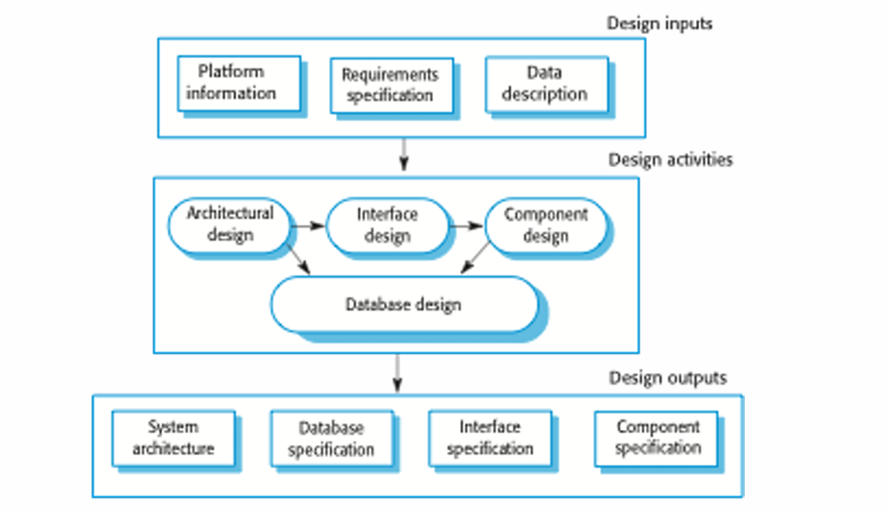

- Involves designing a **software structure** that realizes the system specification.
- Focuses on breaking down the system into manageable components and defining how these components interact.

##### **Design Activities**

1. **Architectural Design**
   - Involves identifying the **overall structure** of the system.
   - Defines the **principal components** (or **modules**), their relationships, and how they will be **distributed** across the system.
   - Example: Deciding between a **client-server** or **microservices** architecture.
2. **Interface Design**
   - Focuses on **defining the interfaces** between system components.
   - Specifies how different parts of the system will communicate with each other and with external systems.
   - Example: Designing **APIs** or specifying **protocols** for communication.
3. **Component Design**
   - Defines how **each individual system component** will operate.
   - Involves detailed design of **functions, algorithms**, and **data flows** for each component.
   - Example: Designing a **login module** that handles authentication.
4. **Database Design**
   - Involves designing the **data structures** for the system and deciding how the data will be stored, represented, and accessed.
   - Defines the **schema**, **tables**, and **relationships** in the **database**.
   - Example: Designing **relational databases** with **foreign keys** and **indexes**.

##### **Implementation**

- Involves **translating the design** into an **executable program**—coding the components, integrating them, and making the system functional.

##### **Design and Implementation Relationship**

- These activities are closely linked and may be **interleaved**, meaning **designing and coding** can happen **simultaneously** as the software evolves.

The process of **designing and implementing** a system involves turning abstract requirements into a detailed, functional program. This requires activities such as **architectural design**, **interface design**, **component design**, and **database design**, which are often interwoven during the development process. The aim is to create a system that is both **efficient** and **maintainable**.

------

#### 3. <u>Software Validation</u>

**Verification and Validation (V & V)** is the process of ensuring that a software system **conforms to its specification** and meets the **requirements of the customer**. This ensures the **correctness**, **reliability**, and **quality** of the software.

###### **V & V Activities**

- **Checking**: Involves examining the system, code, or design to ensure it matches the intended specifications.
- **Reviewing**: Involves stakeholder and team reviews of the system at different stages of development.
- **System Testing**: Running the system with **test cases** derived from real-world data to confirm that it behaves as expected.
- **Testing** is the most widely used V & V activity to ensure that the system performs its intended tasks and meets requirements.

------

###### **Testing Stages**

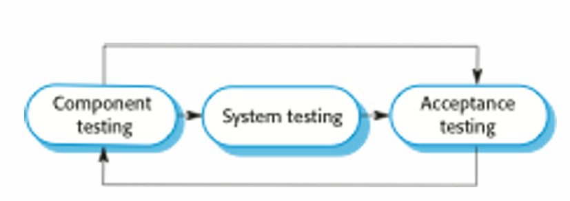

1. **Development or Component Testing** -> unit testing

- Focuses on **testing individual components** of the system in isolation.
- Components could be:
  - **Functions**
  - **Objects**
  - Groups of these entities (like a module or service)
- The goal is to check if each individual component works as expected before integrating it into the system.
- **Example**: Testing a **login function** independently of the rest of the application.

2. **System Testing** -> integrate testing 

- Involves testing the **entire system** as a whole.
- This stage focuses on testing the **emergent properties** of the system—properties that arise from the interaction of the system components.
- **Example**: Ensuring the **user interface**, **backend processes**, and **database interactions** work together as expected.
- The aim is to verify the **overall behavior** and **performance** of the system.

3. **Acceptance Testing**

- This is **customer-driven testing**, where the system is tested with **real customer data** to check that it satisfies the **customer’s needs and requirements**.
- Acceptance testing verifies that the system fulfills its **functional** and **non-functional requirements** as per the customer's expectations.
- **Example**: A **client demo** of the final product with actual business data to see if the system works for their use cases.

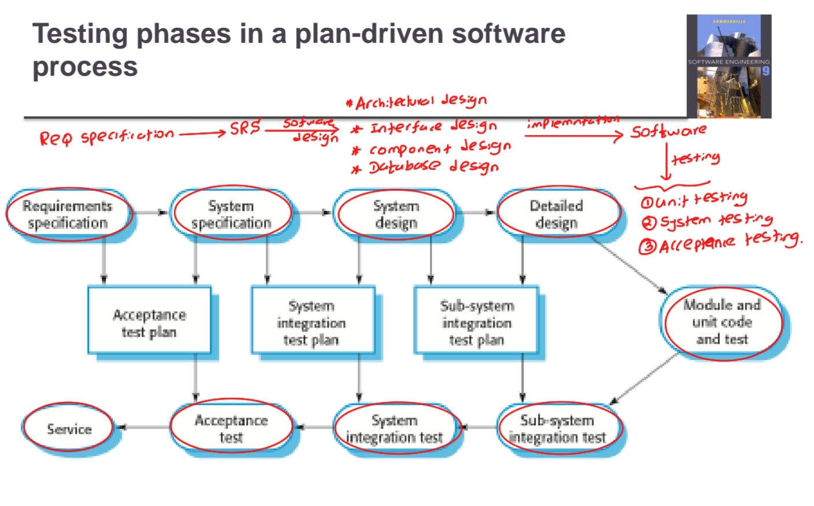

------

#### 4. <u>Software evolution</u>

This is the longest process activity, because this will be done until the business is done.

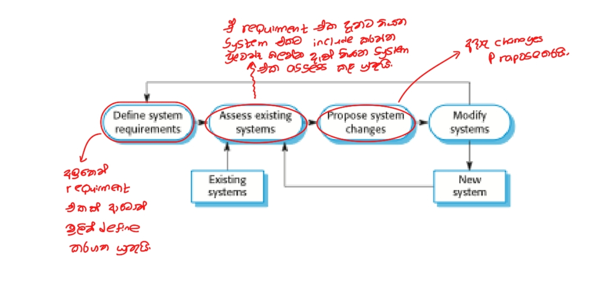

**Software evolution** refers to the process of **adapting and modifying** software over time to accommodate changes in user requirements, business needs, or external factors. Unlike hardware, software is inherently **flexible** and can evolve to meet these changes.

**Key Points about Software Evolution:**

1. **Inherent Flexibility of Software**
   - Software systems are designed to be **dynamic**. They can be modified, extended, and updated as requirements evolve.
2. **Changes Driven by Business Needs**
   - As **business environments** and **user needs** change, the software that supports these processes must evolve.
   - This evolution ensures that the software remains **relevant**, useful, and aligned with current requirements.
3. **Development vs. Evolution**
   - Traditionally, there was a **clear distinction** between the **development** phase (creating new software) and the **evolution** phase (maintenance and updates).
   - However, this distinction is **becoming less relevant** as many modern systems are in a continuous **cycle of evolution** rather than being entirely new systems.
   - **New software systems** often already need frequent updates and adjustments from the start to accommodate changing user demands or business conditions.

**Software Evolution in Practice**

- **Ongoing maintenance** and **updates** become integral parts of the software lifecycle.
- The concept of **continuous integration** and **delivery** (CI/CD) has emerged to accommodate this evolving nature.
- As a result, software is rarely static—rather, it is continuously **refined**, **adapted**, and **optimized** to stay useful and effective over time.

------

# Part 2

## Copying with change

**Change** is an inherent part of all **large software projects**. It arises from various factors, including evolving business requirements, advancements in technology, and changes in the platforms used for development.

> ### **Reasons for Change**
>
> 1. **Business Changes**
>    - New or evolving business needs often lead to **changes in system requirements**.
>    - As a business grows or shifts direction, the software must adapt to **new goals** and **processes**.
> 2. **New Technologies**
>    - Technological advancements can offer **new opportunities** for improving software systems.
>    - New tools, frameworks, and technologies can **optimize** or **enhance** existing systems.
> 3. **Changing Platforms**
>    - **Platform changes** (e.g., operating systems, hardware, or cloud infrastructure) may require the software to undergo modifications to ensure compatibility.
>
> ### **Impact of Change**
>
> - Change often results in **rework**, which adds to the overall costs of software development.
> - Costs include:
>   - **Rework costs** (e.g., reanalyzing requirements or redesigning components).
>   - **Implementation costs** for adding **new functionality** or adapting the software to new requirements.
>
> ------
>
> ### **Reducing the Costs of Rework**
>
> To reduce the **costs** associated with rework, organizations can implement strategies to **anticipate** and **accommodate** changes more effectively:
>
> **1. Change Avoidance**
>
> - Involves anticipating possible changes before they occur, so that the software process can address them **early** in the development cycle.
> - **Example**: Building a ==**prototype system**== to showcase key features and get early feedback from stakeholders.
> - The goal is to identify potential changes **early on**, before significant resources are spent on developing the system.
>
> **2. Change Tolerance**
>
> - The software process is designed to **accommodate changes at low cost**.
> - **Incremental Development** is a common approach to implement change tolerance, where changes are introduced in small, manageable increments.
> - If changes need to be made, **only a small part** of the system may need to be altered, making the process less costly.
> - **Example**: If a change in the system requirements arises, it may be possible to make the change in a **future increment**, without affecting the whole system.

------

### 1. Software prototyping

:arrow_forward: ==change avoidance==

A **prototype** is an initial, working version of a system created to demonstrate concepts, explore design options, and validate requirements before fully committing to development. It allows stakeholders to interact with a basic version of the software, providing valuable feedback for improving the final system.

ex:- UI design by FIGMA before implementing it in the project 

#### **Some uses of Prototypes:**

1. Requirements Engineering:
   - Prototypes help in **requirements elicitation** by allowing users and stakeholders to interact with the system early on, providing insights into what features are necessary or desirable.
   - They also assist in **requirements validation**, ensuring the software meets the intended needs of users.
2. Design Process:
   - Prototypes are used to **explore different design options**, especially for areas where the final design is uncertain or requires user feedback, such as the **user interface (UI)**.
3. Testing Process:
   - Prototypes can be used in testing, allowing teams to run **back-to-back tests** to assess functionality, user interactions, or specific features under real-world conditions.

------

#### **Benefits of Prototyping:**

1. **Improved System Usability:**
   - By involving users early in the process, prototypes ensure the system is more **user-friendly** and aligned with user needs.
2. **Closer Match to User Needs:**
   - Continuous feedback during prototyping ensures the final system reflects the **real needs** and preferences of users, improving its relevance and effectiveness.
3. **Improved Design Quality:**
   - By exploring and refining design options, prototypes allow teams to **test and enhance design** quality before committing to the final system.
4. **Improved Maintainability:**
   - Prototypes help identify potential issues early, leading to software that is **easier to maintain** and adapt over time based on evolving needs.
5. **Reduced Development Effort:**
   - Prototyping helps clarify requirements and design choices early, reducing time spent on unnecessary work or rework. This leads to a more efficient development process overall.

------

#### **Prototype Development:**

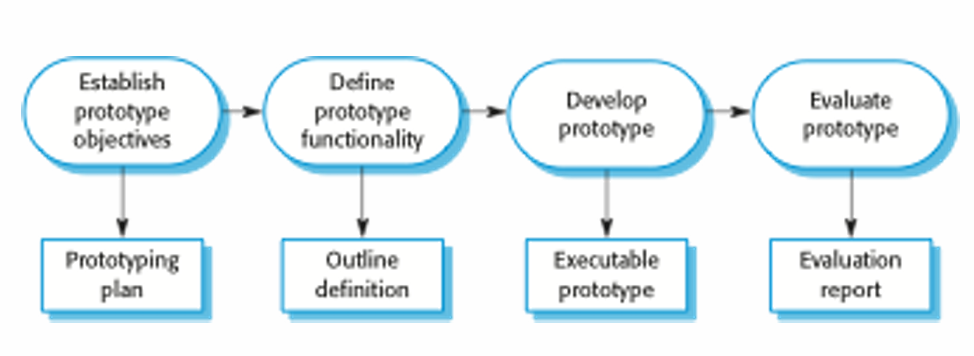

- **Rapid Prototyping Tools**: Prototypes are often built using **rapid prototyping languages** or **tools** designed for speed and flexibility. These tools allow for quick iteration and modification of features based on user feedback.
- **Incomplete Functionality**: Prototypes are not fully functional systems. They may **leave out non-essential functionality**, focusing primarily on areas that are **uncertain or poorly understood**. Some features may be simplified or omitted (e.g., **error checking**, **reliability**, or **security**).

#### **Reasons for Discarding Prototypes:**

Prototypes should be discarded after development as  they are not a good basis for a production system:

1. **Non-functional Requirements**: Prototypes typically lack the **non-functional requirements** (like performance, security, or scalability) that are essential for a production-ready system.
2. **Lack of Documentation**: Prototypes are often developed quickly and without sufficient **documentation**, making them difficult to maintain or scale in the future.
3. **Degraded Structure**: Since prototypes evolve rapidly through iterations and changes, their **structure** tends to degrade, making them unsuitable as a foundation for a finished product.
4. **Quality Standards**: Prototypes do not meet the **standard quality** or compliance requirements necessary for a production-ready system.

------

### 2. Incremental Delivery

:arrow_forward: ==Change Tolerance==

Incremental delivery is a **software development approach** where the system is developed and delivered in smaller, manageable increments instead of as a **single large release**. Each increment (Sprint) **adds new functionality**, and the system evolves over time.

------

##### **Key Characteristics of Incremental Delivery:**

- **Phased Development & Delivery**: The system is built in increments, with each increment **delivering part of the required functionality**.
- **Prioritized User Requirements**: Features are **prioritized**, with high-priority requirements implemented in **earlier increments**.
- **Frozen Requirements for Current Increment**: Once an increment is in development, its **requirements are fixed**, but **later increments can evolve** based on feedback.

------

##### **Incremental Development vs. Incremental Delivery**

**1. Incremental Development**

- The system is **developed in increments** and **evaluated** after each stage.
- Common in **agile methodologies** like **Scrum and Extreme Programming (XP)**.
- Evaluation is typically done by **users or a customer proxy**.
- ==But the delivery is single delivery, development is done by incrementing==

**2. Incremental Delivery**

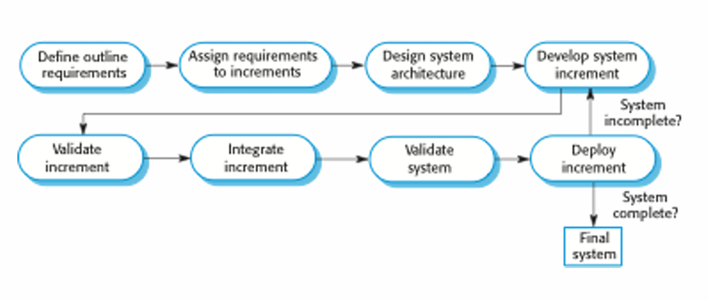

==In here we will deploy the developed part as well==

- Each increment is **delivered to end-users** for real-world use.
- Provides a **more realistic evaluation** based on actual user interaction.
- **Challenging for replacement systems**, since early increments may have **less functionality** than the legacy system being replaced.

------

##### **Advantages of Incremental Delivery**

1. **Early Customer Value**
   - Users can **start using** the software earlier instead of waiting for the full system.
2. **Early Feedback & Requirement Refinement**
   - Initial increments serve as **prototypes**, helping to refine requirements for later stages.
3. **Reduced Project Failure Risk**
   - Since **partial working systems** are delivered incrementally, the risk of **total project failure is lower**.
4. **More Testing for High-Priority Features**
   - The **most important features** are implemented first, leading to **more thorough testing** and better stability.

------

##### **Challenges of Incremental Delivery**

1. **Difficulty in Identifying Common System Components**
   - Many systems require **shared foundational components**. Since requirements evolve **incrementally**, it may be hard to identify these early. හැම එකටම පොදුවේ අවශ්‍ය කරන components මුලින්ම identify කරගන්න අමාරුයි මොකද අපි complete documentation එකකට යන්නේ නෑනේ incremental එකේදී.
2. **Conflicts with Traditional Procurement Models**
   - Some organizations expect a **complete system specification** before development begins, but **incremental methods evolve the system over time**. 
   
     ex: Critical system should be have everything built from beginning with 100% accuracy: hence for these type of systems single delivery is the best
     ex: An insulin pump system at hospital

------

# Advanced software process models

## 1. Boehm’s spiral model

The **Boehm Spiral Model** is a <mark>risk-driven</mark> software development model that emphasizes iterative refinement and continuous risk assessment. Here’s a breakdown of its key aspects:

#### **Core Characteristics**

- **Spiral Structure:** Unlike linear models, the process moves in loops, each representing a development phase.
- **Flexibility:** No predefined phases like Waterfall; phases depend on project needs.
- **Risk Management:** Risk analysis is a core activity at every phase to mitigate potential project failures.

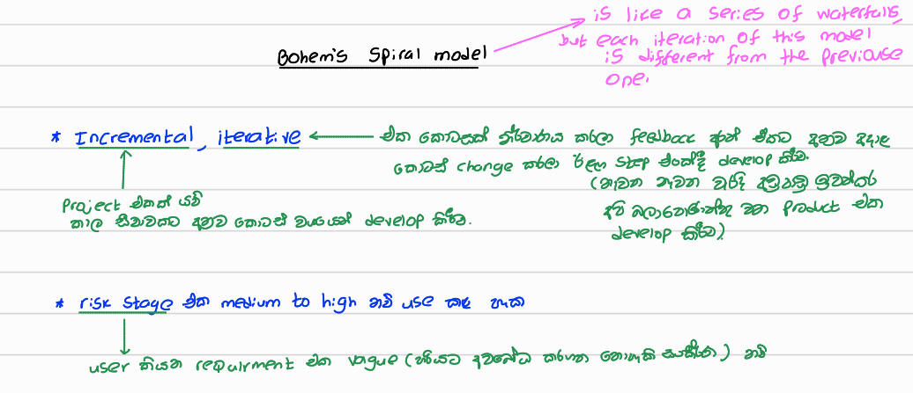

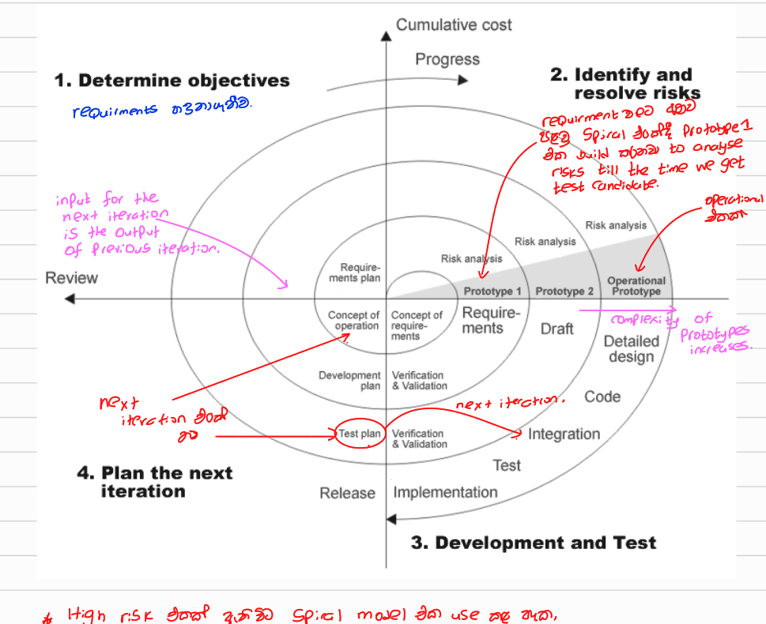

#### **Four Sectors of Each Spiral Loop**

1. **Objective Setting:** Define the goals and constraints for the current phase.
2. **Risk Assessment and Reduction:** Identify and address major risks through prototyping or analysis.
3. **Development and Validation:** Choose an appropriate development approach (Waterfall, Agile, etc.).
4. **Planning:** Evaluate progress and plan for the next iteration.

#### **Usage & Impact**

- **Influence:** It popularized iterative development and risk-driven planning.
- **Practical Adoption:** Though rarely used in its original form, its principles have influenced modern methodologies like Agile.

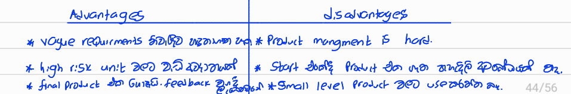

## 2. The Rational Unified Process

The **Rational Unified Process (RUP)** is a structured software development methodology designed to improve the quality and efficiency of software projects. It is based on **Unified Modeling Language (UML)** and incorporates best practices from different software development approaches.

 ✔ **Iterative Development:** Software is developed in cycles, improving with each iteration.
 ✔ **Use of UML:** Visual models help in designing and understanding the system.
 ✔ **Risk-Driven Approach:** Identifies and manages risks at each phase.
 ✔ **Component-Based Architecture:** Promotes reusability and modularity.
 ✔ **Well-Defined Phases & Best Practices:** Ensures organized and efficient development.

 ✔ **Brings together aspects of the 3 generic process models  discussed previously** ... (i.e. waterfall, iterative dev, reuse oriented S.E.)

------

#### **Three Perspectives of RUP**

The rational unified model is normally described in three perspectives.

1. **Dynamic Perspective** – Focuses on phases over time (how the process evolves).
2. **Static Perspective** – Defines the core activities of software development.
3. **Practice Perspective** – Provides best practices to follow during development.

------

#### **Four Phases of RUP**

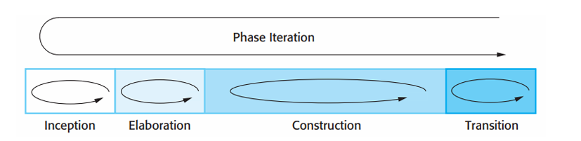

Each phase has specific goals and is iterative, meaning it may be revisited multiple times.

##### <u>1️⃣ **Inception Phase** (Defining the Project)</u>

**Purpose:** Establish the business case and feasibility of the project.
 🔹 Identify stakeholders, goals, and risks.
 🔹 Estimate costs, resources, and timelines.
 🔹 Define high-level system requirements.
 🔹 Deliverables: Vision Document, Business Case, Initial Risk Assessment.

##### <u>2️⃣ **Elaboration Phase** (Planning & Designing)</u>

**Purpose:** Develop a clear understanding of requirements and system architecture.
 🔹 Analyze requirements in detail.
 🔹 Define the system architecture and technology stack.
 🔹 Create high-level UML models (Use Cases, Class Diagrams).
 🔹 Deliverables: Software Architecture Document, Prototype, Updated Risk Assessment.

##### <u>3️⃣ **Construction Phase** (Developing & Testing)</u>

**Purpose:** Implement the system based on the design.
 🔹 Develop software using iterative cycles.
 🔹 Perform unit and integration testing.
 🔹 Refine the architecture if necessary.
 🔹 Deliverables: Codebase, Test Reports, User Documentation.

##### <u>4️⃣ **Transition Phase** (Deploying & Maintaining)</u>

**Purpose:** Deploy the system to users and ensure smooth transition.
 🔹 Conduct user training and support.
 🔹 Address deployment issues and feedback.
 🔹 Finalize system documentation.
 🔹 Deliverables: Final Software Release, Training Materials, Support Plan.

#### **Iteration in RUP**

 🔄 **In-Phase Iteration:** Each phase is iterative, meaning results are developed gradually within the phase.
 🔄 **Cross-Phase Iteration:** The project can revisit earlier phases if necessary (e.g., refining requirements in construction).

------

#### static workflows in the RUP

In RUP, **static workflows** represent different activities that occur throughout the software development lifecycle. These workflows ensure that the system is developed, tested, deployed, and maintained effectively.

##### <u>**Core Workflows** (Primary Development Activities)</u>

**1️⃣ Business Modeling**

📌 **Purpose:** Understand and model the business environment before designing the system.
 🔹 Business processes are represented using **business use cases** to identify key activities.
 🔹 Helps in aligning the software system with business needs.

**2️⃣ Requirements**

📌 **Purpose:** Define what the system should do.
 🔹 Identify **actors** (users or external systems) interacting with the system.
 🔹 Develop **use cases** to describe system requirements clearly.

**3️⃣ Analysis and Design**

📌 **Purpose:** Structure the system based on requirements.
 🔹 Create **design models**, including:
 ✅ **Architectural models** – High-level system structure.
 ✅ **Component models** – Modular software components.
 ✅ **Object models** – Relationships between system objects.
 ✅ **Sequence models** – Order of interactions between system components.

**4️⃣ Implementation**

📌 **Purpose:** Develop the actual system components.
 🔹 Break the system into **sub-systems** for better organization.
 🔹 Use **automatic code generation** from design models to speed up development.

**5️⃣ Testing**

📌 **Purpose:** Ensure the software meets quality standards.
 🔹 Testing occurs **iteratively** alongside implementation.
 🔹 **System testing** happens after implementation is complete.

**6️⃣ Deployment**

📌 **Purpose:** Deliver the software to users.
 🔹 **Product release** is created, distributed, and installed in workplaces.
 🔹 Ensure smooth transition for end users.

##### <u>**Supporting Workflows** (Project and Process Management)</u>

**7️⃣ Configuration & Change Management**

📌 **Purpose:** Handle modifications and updates to the system.
 🔹 Tracks and manages software changes throughout the lifecycle.
 🔹 Ensures that updates do not disrupt system functionality.

**8️⃣ Project Management**

📌 **Purpose:** Oversee the development process.
 🔹 Includes planning, tracking progress, and managing risks.
 🔹 Helps ensure project stays within scope, time, and budget.

**9️⃣ Environment**

📌 **Purpose:** Provide necessary tools and infrastructure.
 🔹 Ensures the development team has the right software tools.
 🔹 Manages hardware and software configurations for development.

------

#### **Best Practices in RUP**

 ✅ **Develop Software Iteratively:** Deliver high-priority features first, refining them over time.
 ✅ **Manage Requirements:** Maintain a clear record of requirements and track changes.
 ✅ **Use Component-Based Architectures:** Structure the system as reusable modules.
 ✅ **Visually Model Software:** Use UML diagrams to improve understanding.
 ✅ **Verify Software Quality:** Ensure the software meets quality standards through testing and validation.
 ✅ **Control Changes:** Use configuration management tools to track changes systematically.

------

#### **Conclusion**

- **RUP is flexible, iterative, and risk-driven**, making it suitable for large and complex projects.
- **It blends elements of Waterfall, Agile, and Component-based development**, ensuring a structured yet adaptive approach.
- **Although RUP is not as widely used today, its principles influence modern methodologies like Agile and DevOps.**

##  
