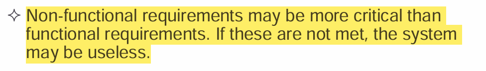
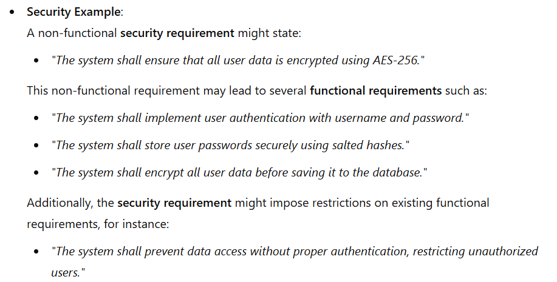

#                         Requirement engineering

Requirements engineering 

-  The process of establishing the services that the  customer requires from a system and the constraints  under which it operates and is developed.  

- > [!TIP]
  >
  > So there are two parts.
  >
  > 1. customer tries to understand what is required and explaining on his own terms this is what I need and then the developer tries to provide the solution to those required conditions.
  > 2. When you do that, what are the conditions that we must obey?
  >
  > So these two parts, one the users needs and wants and the other the developers constraints.
  >
  > 
  >
  > We consider both these factors and when we properly analyze them in document, we call it the <u>requirement specification</u> and the <u>process of doing it called the requirement engineering</u>

## What is a requirement?

> [!TIP]
>
> A **requirement** is a statement that defines a system's service, function, or constraint. It can be expressed in different levels of detail, from broad descriptions to precise specifications.
>
> ### **Understanding the Dual Function of Requirements**
>
> 1. **High-Level Requirements (Open to Interpretation)**
>
>    - These are broad statements that define what a system should achieve but leave room for interpretation.
>
>    - Often used when <u>bidding for a contract, where suppliers propose their own solutions</u>.
>
>    - Example: 
>
>      "The system should provide secure access for users."
>
>      - This doesn't specify how security is implemented (e.g., password-based login, biometric authentication, etc.).
>
> 2. **Detailed Requirements (Precise and Unambiguous)**
>
>    - These are exact specifications that define how a system must behave.
>    - <u>Used in contracts where the system must meet specific criteria.</u>
>    - Example: *"The system shall authenticate users using OAuth 2.0, supporting Google and Facebook login."*
>
> ### **Why Both Are Called Requirements?**
>
> - At different stages of development, both broad and specific requirements exist.
> - In the early phases, high-level requirements help define project goals.
> - As the project progresses, detailed requirements ensure correct implementation.
> - Even though they serve different purposes, both types are still **requirements** because they define what the system must achieve.

When you write, you should explain what is required, what is needed rather than how to solve it or what should be the solution.

------

## Types of requirements

**User Requirements**

- These are high-level descriptions of what users expect the system to do.
- They are written in **natural language** (easy to understand) and may include **diagrams** to clarify functionality.
- Example:
  - *"The system shall allow users to add, split, and track shared expenses among group members."*
  - *"Users should receive notifications when payments are due."*

**System Requirements**

- These are **detailed** and **structured** specifications of the system’s functions, constraints, and behaviors.
- May be used in **contracts** to ensure the system meets the agreed expectations.
- Example:
  - *"The system shall store transaction data in a relational database and ensure ACID compliance."*
  - *"Users shall be able to log in using OAuth 2.0 authentication with Google and Facebook."*

## Three categories of requirements

#### **1. Functional Requirements**

These describe ==**what**== the system should do. They define the system's behavior in response to inputs and specific conditions.

- **Purpose**: Defines system features and services.
- **Focus**: User interactions, system processes, and expected outcomes.
- **May also state what the system should NOT do.**
- Example (for a shared expense management app):
  - *"The system shall allow users to create expense groups and add members."*
  - *"When a user adds an expense, the system shall automatically calculate and distribute the cost among group members."*
  - *"Users shall be able to settle debts through integrated payment gateways like PayPal or Stripe."*
- ==Whatever you draw in the use case diagram is a functional requirement==

**Functional requirements** describe **what** the system should do — the specific behaviors, actions, or services it must provide.

Consider below functional requirements for the MHC-PMS for further understanding.

> [!WARNING]
>
> ## Requirement imprecision
>
> - Problems arise when requirements are not precisely stated.
>
> - Ambiguous requirements may be interpreted in different ways by developers and users.
>
> - Consider the term ‘search’ in requirement 1
>
>   
>
> ## Requirements completeness and consistency
>
> #### **1. Completeness**
>
> A **complete** set of requirements includes **all** the necessary descriptions of the system’s functionality and behavior. It covers every aspect of the system that needs to be specified.
>
> - **Example of completeness**:
>   - If you're building an **expense management app**, completeness would mean covering **all** use cases (like adding, splitting, and paying debts) and ensuring the app also meets **non-functional** requirements like security, performance, and accessibility.
>
> ------
>
> #### **2. Consistency**
>
> **Consistency** means that the **requirements** do not contradict each other. There should be no conflicting descriptions of how the system should behave. Conflicts between requirements can lead to confusion during development and testing.
>
> - **Example of inconsistency**:
>   - If a **shared expense management app** requirement says *"Users should be able to delete an expense"* and another requirement states *"The system should keep a history of all expenses, even if deleted,"* this could lead to confusion regarding the behavior of deleted expenses.
>
> <u>In practice, it is impossible to produce a complete and  consistent requirements document.</u>

------

#### **2. Non-Functional Requirements**

These define **==how== well** the system should perform rather than what it should do. They impose constraints on system operations, such as performance, security, and usability.

- **Purpose**: Sets quality standards for the system.
- **Focus**: Performance, reliability, security, usability, scalability, and compliance.
- **Often applies to the system as a whole rather than individual features.**
- Example (for a shared expense management app):
  - *"The system shall process expense calculations within 2 seconds."* (Performance)
  - *"The app shall be available 99.9% of the time (uptime guarantee)."* (Reliability)
  - *"All user data shall be encrypted using AES-256."* (Security)
  - *"The UI shall follow WCAG 2.1 accessibility guidelines."* (Usability)
  - <u>Constraints are I/O device capability, system  representations, etc</u>
- Process requirements are also non functional. 

> [!IMPORTANT]
>
> ## Non functional Requirements implementation
>
> 
>
> 

> [!IMPORTANT]
>
> ## Types of non functional requirements
>
> 
>
> | **Classification**              | **Definition**                                               | **Example**                                               | **Impact**                                        |
> | ------------------------------- | ------------------------------------------------------------ | --------------------------------------------------------- | ------------------------------------------------- |
> | **Product Requirements**        | Define how the system should behave in terms of quality attributes. | *The system shall process transactions within 2 seconds.* | Affects performance, security, and usability.     |
> | **Organizational Requirements** | Internal policies or standards that influence system development. Can be from developing organization or business organization | *Development must follow Agile methodology.* -> dev       | Affects development practices and tool selection. |
> | **External Requirements**       | Requirements imposed by laws, regulations, or external systems. | *The system must comply with GDPR.*                       | Ensures compliance and interoperability.          |
>
> 

> [!IMPORTANT]
>
> ### **Goals and Requirements in Non-Functional Requirements (NFRs)**
>
> Non-functional requirements (NFRs) often present **challenges in precise definition and verification**. Unlike functional requirements, which describe **what** a system should do, NFRs describe **how well** it should perform. Because of their subjective nature, NFRs must be carefully **translated from broad goals into measurable, verifiable requirements**.
>
> ------
>
> ### **1. Goals vs. Verifiable Non-Functional Requirements**
>
> | **Concept**                               | **Definition**                                               | **Example**                                                  |
> | ----------------------------------------- | ------------------------------------------------------------ | ------------------------------------------------------------ |
> | **Goal**                                  | A broad, general intention of the user. Often subjective and hard to measure. | *"The system should be easy to use."*                        |
> | **Verifiable Non-Functional Requirement** | A specific statement that uses measurable criteria, making it possible to test objectively. | *"The system shall allow a new user to complete account registration within 2 minutes."* |
>
> 
>
> 💡 **Key Difference:**
>
> - **Goals** express **intentions** (e.g., *“The system should be secure.”*).
> - **Verifiable requirements** define **measurable conditions** to ensure compliance (e.g., *“All user passwords shall be stored using AES-256 encryption.”*).
>
> 
>
> ## Metrices for specifying non functional requirements
>
> 

------

#### **3. Domain Requirements**

These are **constraints** or **rules** that come from the domain (industry or field) in which the system operates.

- **Purpose**: Ensures compliance with industry-specific regulations or workflows.
- **Focus**: Laws, business rules, and operational standards.
- Example (for a shared expense management app):
  - *"The system shall comply with financial regulations such as GDPR and PCI-DSS."*
  - *"The system shall support multiple currencies and handle currency conversion using real-time exchange rates."*
  - *"Transactions shall be logged and stored for audit purposes for at least 5 years."*

Train protection system example

Domain requirements problems

------

## The Software requirement document

The **Software Requirements Document (SRD)** serves as the **official statement** of what the system must do. It acts as a **contract** between stakeholders (clients, users, and developers) to ensure that everyone understands the system's objectives before development begins.

------

### **1. Purpose of the SRD**

 ✅ **Defines the system’s required functionality**
 ✅ **Distinguishes between user and system requirements**
 ✅ **Ensures clarity and agreement between stakeholders**
 ✅ **Avoids ambiguity and misinterpretation**

 🔹 **Contains WHAT the system should do, not HOW it does it  (not the specific technology or architecture to achieve it.)**
 🔹 **Does not include system design**—that is done in later phases

Example:
 ❌ **Bad (Design-Specific)** – *“The system shall use a MySQL database to store expenses.”*
 ✅ **Good (Requirement-Focused)** – *“The system shall store expenses and allow users to retrieve them in under 2 seconds.”*

### 2. SRD vs Agile methods

**For critical system, SRS must be detailed and correct.**

### 3. Users of a requirements document 

### 4. The structure of a requirement document

> [!WARNING]
>
> ### **1. Preface**
>
> - Defines the **intended audience** of the document.
> - Tracks the **version history**, explaining why a new version was created and summarizing changes made in each version.
>
> ### **2. Introduction**
>
> - Describes the **purpose and need** for the system.
> - Summarizes its **functions and interactions** with other systems.
> - Explains how the system fits into the organization's **business strategy**.
>
> ### **3. Glossary**
>
> - Defines **technical terms** used in the document to ensure clarity.
> - Helps **non-experts** understand domain-specific terminology.
>
> ### **4. User Requirements Definition**
>
> - Describes the **services the system provides** from a user’s perspective.
> - Includes both **functional** and **non-functional** user requirements.
> - Uses **natural language, diagrams, or visual notations**.
> - Specifies **product and process standards** that must be followed.
>
> ### **5. System Architecture**
>
> - Provides a **high-level overview** of the system's architecture.
> - Shows how **functions are distributed** across different modules.
> - Highlights any **reused architectural components**.
>
> ### **6. System Requirements Specification**
>
> - Expands on the **functional and non-functional requirements**.
> - Describes **interfaces with other systems**.
> - Adds more details to any **critical non-functional constraints**.
>
> ### **7. System Models**
>
> - Includes **graphical representations** of system components and their relationships.
> - Possible models include:
>   - **Object models** (relationships between system objects).
>   - **Data-flow models** (how data moves through the system).
>   - **Semantic data models** (structure of the data).
>
> ### **8. System Evolution**
>
> - Describes **assumptions** about the system's environment.
> - Predicts **future changes** due to hardware advancements, user needs, etc.
> - Helps avoid **design decisions** that could limit future system modifications.
>
> ### **9. Appendices**
>
> - Contains detailed technical information, such as:
>   - **Hardware requirements** (minimum/optimal configurations).
>   - **Database requirements** (logical structure of data and relationships).
>
> ### **10. Index**
>
> - Provides multiple indexes for easy navigation:
>   - **Alphabetic index** of terms.
>   - **Diagram index**.
>   - **Function index**, etc.

### 5. Requirements specification (SRS)

==Requirements specification is the process of **documenting** both **user** and **system requirements**== in a structured document, often as part of a formal contract for system development.

**Key Aspects of Requirements Specification**

✅ **User Requirements**

- Written in a way that **non-technical stakeholders** (customers, end users) can understand.
- Uses **natural language** and simple **diagrams** to describe **system functions and constraints**.

✅ **System Requirements**

- More **detailed** and **technical** than user requirements.
- Includes **functional and non-functional requirements**, along with **interfaces, data structures, and system constraints**.
- Serves as a **blueprint for developers and engineers**.

✅ **Contractual (ගිවිසුම්ගත) Importance**

- If requirements are part of a **contract**, they must be **clear, complete, and precise** to prevent misunderstandings.
- Ambiguous or incomplete requirements can lead to **disputes and project failures**.

#### <u>Ways of writing a SRS</u>

#### 1. Natural Language specification

<u>Guidelines for writing natural language specification</u>

✅ **Use a Standard Format**

- Maintain **consistency** across all requirements.
- Example:
   **ID:** FR-001
   **Requirement:** *The system shall allow users to split expenses among group members.*
   **Rationale:** *Ensures fair cost-sharing in group expenses.*

✅ **Use Clear and Consistent Language**

- Use "shall" for mandatory requirements.
  - *Example: "The system shall store all transactions in a secure database."*
- Use "should" for optional/desirable requirements.
  - *Example: "The system should provide an export-to-Excel feature."*

✅ **Use Text Highlighting for Key Points**

- Bold, italics, or capitalization to emphasize key aspects.
  - *Example: **"The system shall encrypt all user data using AES-256."***

✅ **Avoid Computer Jargon**

- Keep requirements understandable for non-technical users.
  - ❌ *"The app shall implement an asymmetric cryptographic algorithm for secure key exchange."*
  - ✅ *"The app shall use encryption to protect user data."*

✅ **Include a Rationale for Each Requirement**

- Explain why a requirement exists to prevent confusion.
  - *Example: "The app shall require email verification to enhance account security and prevent unauthorized access."*

<u>*Problems with natural language specification*</u>

*<u>example</u>*

#### 2. Structured natural language specifications

##### 1. Form based specification

​										   	<u>Guidelines</u>

​											<u>example</u>

##### 2. Tabular specification

ex: Tabular specification of computation for an insulin pump

------

## <u>Requirements engineering processes</u>

**Requirements Engineering (RE)** is the process of defining, documenting, and maintaining system requirements. It ensures that a system meets stakeholder needs while considering technical and business constraints. The **processes used for RE vary widely** depending on the **application domain, the people involved, and the organization developing the requirements**.

***However there are  a number of  generic activities common to all processes.***

> [!TIP]
>
> 1. **Requirements Elicitation** – Gathering requirements through interviews, surveys, and observations.
> 2. **Requirements Analysis** – Refining, prioritizing, and resolving conflicts in requirements.
> 3. **Requirements Validation** – Ensuring requirements are clear, complete, and testable.
> 4. **Requirements Management** – Tracking and handling requirement changes throughout development.

RE is an **iterative activity**, in which these processes are interleaved.

### 1. Requirement elicitation and analysis

> Sometimes called <u>*requirements elicitation*</u> or  *<u>requirements discovery</u>*.

#### problems of requirement analysis

#### How to resolve

#### <u>*requirement discovery*</u>

> elicitation + analysis -> sometime we call this entire thing as discovery and i think this is what referred under this topic

**Requirements Discovery** is the process of gathering information about the required and existing systems to identify user and system requirements. It involves **interacting with various stakeholders**, including managers, end-users, and regulators. Since systems have **multiple stakeholders with different priorities**, careful analysis is needed to ensure all requirements are considered. 

> [!TIP]
>
> Stakeholders in MHC- PMS
>
> 1. **Patients** – Their medical information is recorded and accessed in the system.
> 2. **Doctors** – Assess and treat patients based on system records.
> 3. **Nurses** – Coordinate consultations and administer treatments.
> 4. **Medical Receptionists** – Manage patient appointments.
> 5. **IT Staff** – Install, maintain, and troubleshoot the system.
> 6. **Medical Ethics Manager** – Ensures the system follows ethical guidelines.
> 7. **Health Care Managers** – Use the system for management reporting.
> 8. **Medical Records Staff** – Maintain and preserve patient records.

##### <u>Methods used in requirement discovery</u>

###### 1. Interviewing

> [!TIP]
>
> **Interviewing** is a key technique in **Requirements Engineering (RE)** used to gather information from stakeholders. It can be **formal or informal** and is typically a mix of **closed and open-ended** questions.
>
> #### **Types of Interviews:**
>
> 1. **Closed Interviews** – Follow a pre-determined set of questions.
> 2. **Open Interviews** – Allow flexible discussions to explore various issues.
>
> #### **Effective Interviewing Tips:**
>
> - Be **open-minded** and actively listen to stakeholders.
> - Use **prompting techniques** like springboard questions, proposals, or prototypes.
>
> ✅ **Interviews help** in understanding stakeholder needs and system interactions.
>  ❌ **Interviews are less effective** for domain requirements due to specialized terminology and implicit knowledge. Even they do not specify domain requirements because they are so familiar with them so they think it's not worth specifying (They think we are same like they),   

###### 2. Scenarios

 Scenarios can be used rather than abstract description to gain understand about  requirements

> [!TIP]
>
> Scenario for collecting medical history in MHC PMS 
>
> 
>
> 

###### 3. Use cases

### 2. Requirement validation

### 3.Requirement management
