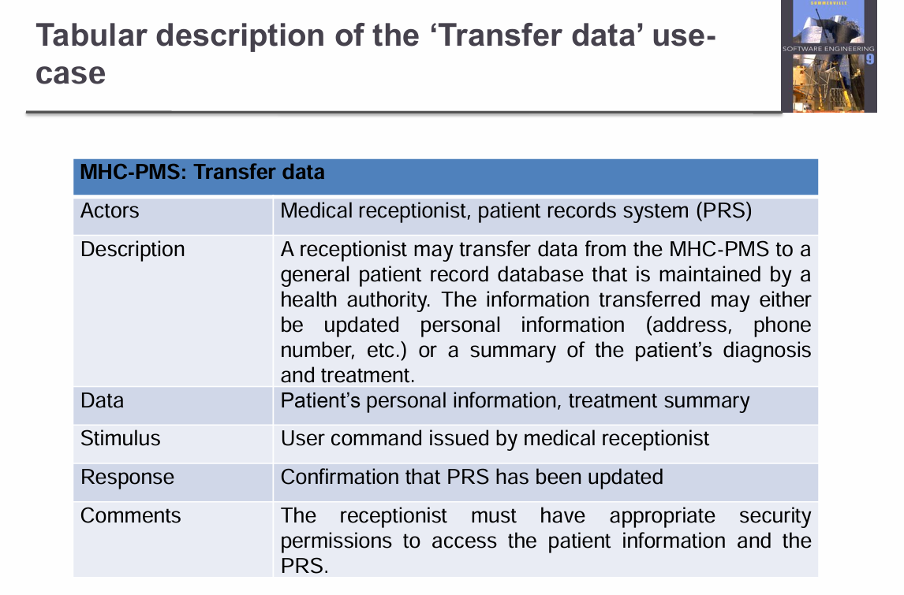
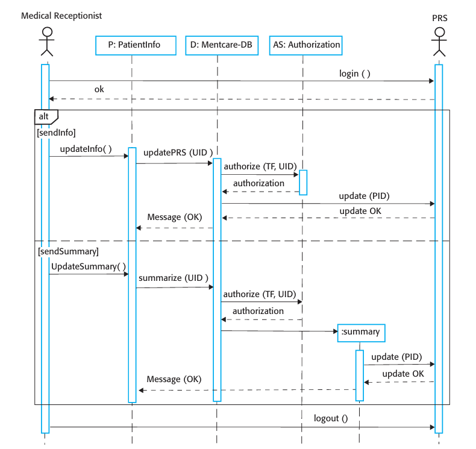
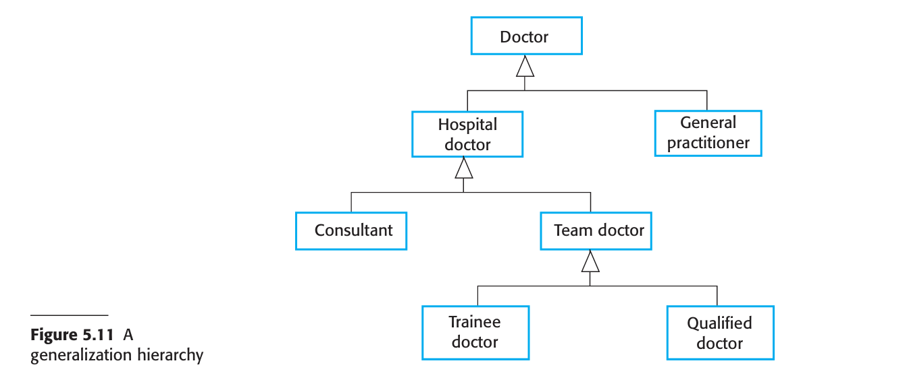
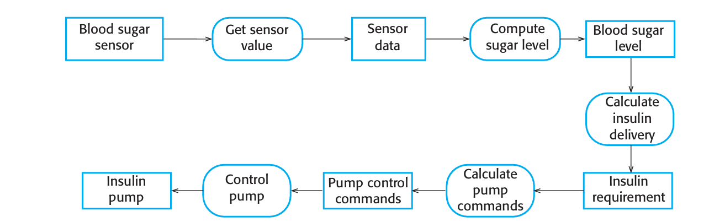

# System Modeling

> [!TIP]
>
> ### 1. **What is System Modeling?**
>
> - **Definition**: It's the process of creating abstract representations of a system, where each model offers a unique view or perspective.
> - **Graphical Notation**: Today, this often uses the Unified Modeling Language (UML), a standardized way to visualize system designs.
> - **Purpose**: It helps analysts comprehend the system's functionality and serves as a communication tool with stakeholders, including customers.
>
> ### 2. **Types of Models in System Modeling**
>
> - **Existing System Models**: These models describe the current system and are primarily used during the **requirements engineering phase** to understand its functionality, strengths, and weaknesses.
>   - They help to clarify what the current system does and can provide the foundation for discussing improvements in the new system.
>   - These models highlight areas that may require changes or updates in the future system.
> - **New System Models**: These models define the proposed design and functionality of the new system, again during the **requirements engineering phase**. They aid in:
>   - Explaining the proposed system to other stakeholders.
>   - Discussing design proposals and documenting the system for implementation.
>   - Potentially allowing for system implementation generation in a **model-driven engineering process**, where part or all of the system code is generated from the model itself.
>
> ### 3. **System Perspectives**
>
> 1. **External Perspective**: Focuses on the system's **context or environment**, answering questions like "What external factors affect the system?" or "What does the system interact with outside its own boundaries?"
> 2. **Interaction Perspective**: Deals with **interactions** between the system and its environment, or between various components of the system. This perspective helps visualize how data flows and how the system reacts to inputs or triggers.
> 3. **Structural Perspective**: Models the **organization** of the system, focusing on its components or data structures. It's concerned with understanding how the system's architecture is set up or how the data is managed internally.
> 4. **Behavioral Perspective**: Represents the **dynamic behavior** of the system, often showing how the system responds to events or changes over time. This includes state transitions, event-driven processes, and any other type of dynamic interaction within the system.
>
> >  context Models-> External perspective
> >
> > Interactional Models ->Interactional perspective
> >
> > Structural Models -> Structural Perspective
> >
> > Behavioral Models -> Behavioral perspective
>
> | **Perspective**             | **Description**                                              | **Example System**                                           | **Example Diagram**                                          |
> | --------------------------- | ------------------------------------------------------------ | ------------------------------------------------------------ | ------------------------------------------------------------ |
> | **External Perspective**    | Models the system’s context and environment, showing external entities that interact with it. | **Banking System**: Interacts with **customers, ATMs, payment gateways, regulatory agencies**. | **Context Diagram**: Shows external actors (users, third-party services) and their interactions with the system. |
> | **Interaction Perspective** | Focuses on interactions between the system and its environment or between system components. | **Online Shopping System**: **User searches for products, adds to cart, and makes payments**, involving authentication, inventory, and order fulfillment. | **Sequence Diagram**: Shows how the user and internal components (cart, payment gateway, order system) communicate. |
> | **Structural Perspective**  | Models the system’s internal organization, data structures, and component relationships. | **University Management System**: Includes **students, professors, courses, and departments**, with defined relationships. | **Class Diagram**: Represents entities like Student, Professor, Course, and their associations. |
> | **Behavioral Perspective**  | Represents the system’s dynamic behavior and responses to events. | **Traffic Light Control System**: **Changes states (Green → Yellow → Red) based on time and traffic conditions**. | **State Diagram**: Shows transitions between traffic light states based on predefined rules. |

# UML Diagram Types

| **UML Diagram**      | **Description**                                              |
| -------------------- | ------------------------------------------------------------ |
| **Activity Diagram** | Shows the activities involved in a process or in data processing. Useful for modeling workflows, business processes, or logic of complex operations. |
| **Use Case Diagram** | Shows the interactions between a system and its environment, focusing on the system's functionalities from a user's perspective. |
| **Sequence Diagram** | Shows interactions between actors and the system, as well as between internal system components, in the order they occur. |
| **Class Diagram**    | Shows the object classes in the system and the associations/relationships between these classes. Helps model the system's static structure. |
| **State Diagram**    | Shows how the system reacts to internal and external events, illustrating the dynamic behavior and state transitions of the system. |

| UML Diagram Type     | Type         |
| -------------------- | ------------ |
| **Activity Diagram** | 🔴 Dynamic    |
| **Use Case Diagram** | 🔴 Dynamic    |
| **Sequence Diagram** | 🔴 Dynamic    |
| **Class Diagram**    | 🔵 Structural |
| **State Diagram**    | 🔴 Dynamic    |

# 1. Context Models

==Context models help visualize how a system interacts with its **external environment**. They define **system boundaries**, *<u>showing what is part of the system and what is outside it</u>*.==

**Key points:**

- Context models are used to illustrate the operational  context of a system - they show what lies outside the  system boundaries.
- **Architectural models** use context models to show how a system fits into a larger structure. Context models provide an overview of how a system integrates with its environment, often serving as a foundation for architectural design.
- **Organizational and social factors** may influence how system boundaries are set.

#### **System Boundaries**

System boundaries define what is included within the system and what is external. These boundaries determine the **system’s scope** and affect **its requirements**.

**Key points:**

- They show **which external systems interact** with the system being developed.
- The **placement of boundaries** can change system functionality and complexity.
- Defining boundaries is sometimes influenced by **organizational or business decisions** (e.g., deciding which tasks are automated vs. manual).

<u>Interactions with external environment</u>

 For example, say you are developing the specification for the Mentcare patient  information system. This system is intended to manage information about patients  attending mental health clinics and the treatments that have been prescribed. In developing the specification for this system, you have to decide whether the system should  focus exclusively on collecting information about consultations (using other systems  to collect personal information about patients) or whether it should also  collect personal patient information. The advantage of relying on other systems for patient  information is that you avoid duplicating data. The major disadvantage,  however, is  that using other systems may make it slower to access information, and if these systems are unavailable, then it may be impossible to use the Mentcare  system.

ex: යම් functionality එකකට API එකක් use කිරීම or Building from scratch

##### <u>context diagrams</u>

Context models normally show that the environment includes several other automated systems. However, they do not show the types of relationships between the  systems in the environment and the system that is being specified. External systems  might produce data for or consume data from the system. They might share data with  the system, or they might be connected directly, through a network or not connected  at all. They might be physically co-located or located in separate buildings. All of these relations may affect the requirements and design of the system being defined  and so must be taken into account. Therefore, simple context models are used along  with other models, such as <u>business process models</u>. These describe human and automated processes in which particular software systems are used.

ex: For a drug addict or a person with mental illness

#### (I). <u>Activity diagrams</u>

> [!IMPORTANT]
>
> 
>
> Sometimes, patients who are suffering from mental health problems may be a  danger to others or to themselves. They may therefore have to be detained against  their will in a hospital so that treatment can be administered. Such detention is subject to strict legal safeguards—for example, the decision to detain a patient must be  regularly reviewed so that people are not held indefinitely without good reason. One  critical function of the Mentcare system is to ensure that such safeguards are implemented and that the rights of patients are respected. UML activity diagrams show the activities in a process and the flow of control  from one activity to another. The start of a process is indicated by a filled circle, the  end by a filled circle inside another circle. Rectangles with round corners represent  activities, that is, the specific subprocesses that must be carried out. You may include  objects in activity charts. Figure 5.2 shows the systems that are used to support different subprocesses within the involuntary detection process.

| **Aspect**             | **Context Models**                                           | **Process Models**                                           |
| ---------------------- | ------------------------------------------------------------ | ------------------------------------------------------------ |
| **Purpose**            | Show the **system's environment** and its external interactions. | Show how the system operates **within business processes** and workflows. |
| **Focus**              | Interactions between the system and **external entities** (users, other systems, hardware). | The **flow of activities** or **steps** in a process, and how the system interacts with components during these steps. |
| **What it Shows**      | - **System boundaries** and what lies outside the system.   - External entities (e.g., users, other systems) and their interactions with the system. | - Detailed **sequence of activities** in business processes.   - **Internal and external system interactions** in the context of workflows. |
| **Level of Detail**    | High-level, focusing on **external relationships**.          | More detailed, showing **specific interactions** in operational workflows. |
| **Common UML Diagram** | **Context Diagram**                                          | **Activity Diagram**, **Sequence Diagram**                   |
| **Example**            | A **banking system** interacting with **customers, ATMs, payment gateways**, and **regulatory bodies**. | A **user placing an order** in an **e-commerce system**, including **inventory checks**, **payment processing**, and **shipping**. |

------

# 2. Interaction Models

| **Aspect**                         | **Description**                                              |
| ---------------------------------- | ------------------------------------------------------------ |
| **User Interaction Modeling**      | Focuses on how **users interact** with the system, ==helping to **identify user requirements** and ensure the system meets their needs.== |
| **System-to-System Interaction**   | Focuses on how **systems communicate** with each other, ==highlighting potential **communication problems** or integration issues that may arise.== |
| **Component Interaction Modeling** | Focuses on how **internal system components** interact, ==helping to understand if the system architecture will deliver the required **performance and dependability**.== |
| **UML Diagrams for Interaction**   | - **Use Case Diagrams**: Show interactions between **actors (users, systems)** and the system.   - **Sequence Diagrams**: Show the <u>**sequence of interactions** between system components or between the system and external entities.</u> |

#### (II). <u>Use case Diagrams</u>

These depict functional requirements.

###### ex 1:

 <u>Transfer - data use case in MHC-PMS</u>

> [!IMPORTANT]
>
> Diagrammatically
>
> 
>
> Detailed textual form
>
> 

###### ex 2:

<u>Use cases in the MHC-PMS involving the role  ‘Medical Receptionist’</u>

> [!IMPORTANT]
>
> 

#### (III). <u>Sequence Diagrams</u>

###### ex 1:

<u>Sequence diagram for View patient information</u>

A sequence diagram shows the sequence of interactions  that take place during <mark>a particular use case or use case  instance.</mark> -> in here this sequence diagram is made for view patient info use case in <u>Use cases in the MHC-PMS involving the role  ‘Medical Receptionist’</u>

###### ex 2:

Sequence Diagram for Transfer Data

 Figure 5.7 is a further example of a sequence diagram from the same system that  illustrates two additional features. These are the direct communication between the  actors in the system and the creation of objects as part of a sequence of operations. In  this example, an object of type Summary is created to hold the summary data that is to be uploaded to a national PRS (patient records system). 

> Unless you are using sequence diagrams for code generation or detailed documentation, you don’t have to include every interaction in these diagrams.

# 3. Structural Models

==In this section, I focus on the use of class diagrams for modeling the static structure of the object classes in a software system==

#### (IV). <u>Class Diagrams</u>

> [!TIP]
>
>  As an implementation is developed, you define implementation objects to represent data that is manipulated by the system. In this section, the  focus is on the modeling of real-world objects as part of the requirements or early  software design processes. A similar approach is used for data structure modeling. Class diagrams in the UML can be expressed at different levels of detail. When  you are developing a model, the first stage is usually to look at the world, identify  the essential objects, and represent these as classes. The simplest way of writing  these diagrams is to write the class name in a box. You can also note the existence of  an association by drawing a line between classes. For example, Figure 5.8 is a simple class diagram showing two classes, Patient and Patient Record, with an association between them. At this stage, you do not need to say what the association is. Figure 5.9 develops the simple class diagram in Figure 5.8 to show that objects of  class Patient are also involved in relationships with a number of other classes. In this  example, I show that you can name associations to give the reader an indication of  the type of relationship that exists. Figures 5.8 and 5.9, shows an important feature of class diagrams—the ability to  show how many objects are involved in the association. In Figure 5.8 each end of the  association is annotated with a 1, meaning that there is a 1:1 relationship between  objects of these classes. That is, each patient has exactly one record, and each record  maintains information about exactly one patient. As you can see from Figure 5.9, other multiplicities are possible. You can define  that an exact number of objects are involved (e.g., 1..4) or, by using a *, indicate that  there are an indefinite number of objects involved in the association. For example,  the (1..*) multiplicity in Figure 5.9 on the relationship between Patient and Condition  shows that a patient may suffer from several conditions and that the same condition  may be associated with several patients
>
> ### Examples from the diagram:
>
> 1. **Patient ↔ Condition (`1..*` to `1..*`)**
>    - A patient can be diagnosed with one or more conditions.
>    - A condition can be diagnosed in one or more patients.
> 2. **Patient ↔ General Practitioner (`1..*` to `1`)**
>    - Each patient is referred by exactly one GP.
>    - Each GP can refer one or more patients.
> 3. **Consultation ↔ Hospital Doctor (`1..*` to `1..4`)**
>    - Each consultation involves 1 to 4 hospital doctors.
>    - Each hospital doctor can be involved in one or more consultations.
> 4. **Consultation ↔ Medication / Treatment (`1..*` to `1..*`)**
>    - Each consultation results in prescriptions for one or more medications or treatments.
>    - Each medication/treatment can be prescribed in one or more consultations.

At this level of detail, class diagrams look like semantic data models. Semantic  data models are used in database design. They show the data entities, their associated  attributes, and the relations between these entities. The UML  does not include a diagram type for database modeling, as it models data using  objects and their relationships. However, you can use the UML to represent a semantic data model. You can think of entities in a semantic data model as simplified  object classes (they have no operations), attributes as object class attributes, and relations as named associations between object classes.

When showing the associations between classes, it is best to represent these classes  in the simplest possible way, without attributes or operations. To define objects in  more detail, you add information about their attributes (the object’s characteristics)  and operations (the object’s functions). For example, a Patient object has the attribute  Address, and you may include an operation called ChangeAddress, which is called  when a patient indicates that he or she has moved from one address to another. In the UML, you show attributes and operations by extending the simple  rectangle  that represents a class. I illustrate this in Figure 5.10 that shows an object representing a consultation between doctor and patient

#### Generalization

General statements apply to all class members; for example, all rodents have teeth  for gnawing.

#### Aggregation

# 4. Behavioral Models

Dynamic behavior

## 1. Data driven modeling

####  data flow diagrams 

 Data-flow diagrams can be represented in the UML using the activity diagram  type

An alternative way of showing the sequence of processing in a system is to use  UML sequence diagrams. You have seen how these diagrams can be used to model  interaction, but if you draw these so that messages are only sent from left to right,  then they show the sequential data processing in the system. 

#### Using sequence diagrams

- ==Sequence models highlight objects in a system, whereas data-flow diagrams highlight the operations or activities.==
-  In practice, nonexperts seem to find data-flow diagrams more intuitive, but engineers prefer sequence diagrams.

## 2. Event driven modeling

#### (V). <u>State Diagrams</u>

In UML state diagrams, rounded rectangles represent system states. They may  include a brief description (following “do”) of the actions taken in that state. The  labeled arrows represent stimuli that force a transition from one state to another. You  can indicate start and end states using filled circles, as in activity diagrams.

>  The problem with state-based modeling is that the number of possible states  increases rapidly. For large system models, therefore, you need to hide detail in the  models. One way to do this is by using the notion of a “superstate” that encapsulates  a number of separate states. This superstate looks like a single state on a high-level  model but is then expanded to show more detail on a separate diagram. To illustrate  this concept, consider the Operation state in Figure 5.16. This is a superstate that can  be expanded, as shown in Figure 5.17

>  State models of a system provide an overview of event processing, but you normally have to extend this with a more detailed description of the stimuli and the system  states. You may use a table to list the states and events that stimulate state transitions  along with a description of each state and event. 
>
> 

## 3. Model - driven engineering

 Model-driven engineering was developed from the idea of model-driven architecture (MDA)

- MDA  focuses on the design and implementation stages of software development, whereas  MDE is  concerned with all aspects of the software engineering process. Therefore,  topics such as model-based requirements engineering, software processes for  model-based development, and model-based testing are part of MDE but are not  considered in MDA.

# 5. Model - driven architecture

