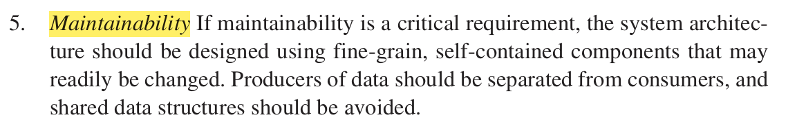
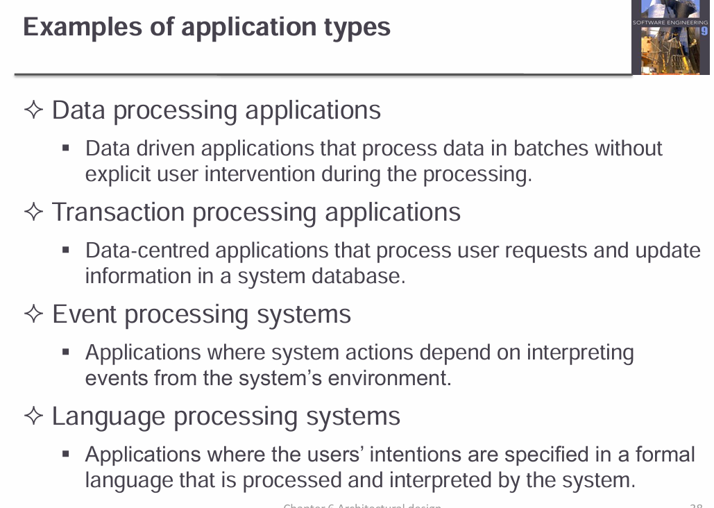
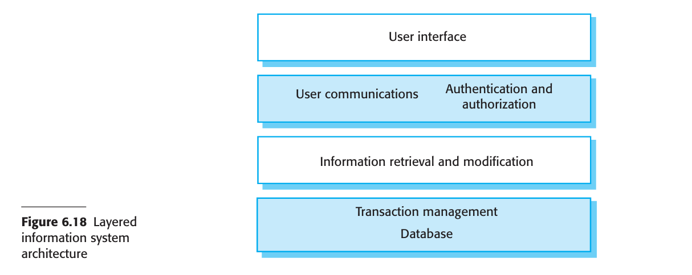

> [!CAUTION]
>
> Requirement engineering, system modeling, and architectural designing are key stages in the **software/system development lifecycle (SDLC)**, and they flow in a logical sequence. Here's a breakdown of how they work together in flow:
>
> ------
>
> ### 🔹 1. **Requirement Engineering** (WHAT the system should do)
>
> This is the **first stage** in the flow.
>
> **Purpose:** Understand and define *what* the stakeholders need from the system.
>
> **Activities:**
>
> - **Elicitation** – Gathering requirements from stakeholders (interviews, questionnaires, observations).
> - **Analysis** – Checking for feasibility, consistency, completeness.
> - **Specification** – Documenting the requirements in a formal way (e.g., SRS – Software Requirements Specification).
> - **Validation** – Making sure requirements are correctly understood and documented.
>
> ➡️ **Output:** A clear and complete set of functional and non-functional requirements.
>
> ------
>
> ### 🔹 2. **System Modeling** (Visualizing the system)
>
> Once requirements are clear, you build models to understand and communicate how the system will behave.
>
> **Purpose:** Create abstract representations of the system (to reduce complexity and improve understanding).
>
> **Types of Models:**
>
> - **Use Case Diagrams** – What functions the system will perform.
> - **Class Diagrams** – Relationships between objects/data.
> - **Activity Diagrams** – Flow of processes or actions.
> - **Sequence Diagrams** – How objects interact in a sequence.
>
> ➡️ **Output:** A set of diagrams/models that represent system behavior and structure.
>
> 
>
> 
>
> 
>
> ------
>
> ### 🔹 3. **Architectural Design** (HOW the system will be built)
>
> This is where high-level planning of the system’s structure happens.
>
> **Purpose:** Define the system’s major components, their responsibilities, interactions, and technologies used.
>
> **Decisions Made:**
>
> - Choice of architecture style (e.g., layered, microservices, client-server).
> - Definition of modules/components and their interfaces.
> - Technology stack selection (databases, frameworks, platforms).
> - Security, scalability, and performance strategies.
>
> ➡️ **Output:** Software architecture document (includes diagrams, decisions, rationale).
>
> 
>
> 
>
> ------
>
> ### 🔄 Flow Summary (in order):
>
> 
>
> 
>
> ```python
> 1. Requirement Engineering
>      ↓
> 2. System Modeling
>      ↓
> 3. Architectural Designing (1st step of designing)
>      ↓
> (Then moves into Detailed Design → Development → Testing → Deployment)
> ```
>
> 

# Architectural Designing


Mind map: https://notebooklm.google.com/notebook/79a6b649-cb90-4c18-8e18-bd4d651d4b32

### what is architectural design

> [!NOTE]
>
> ### 🔷 **Software Architecture**
>
> - It's the **high-level structure** of the software system.
> - It describes **sub-systems (components)** and how they **interact** (communication and control).
> - Think of it like a blueprint of a building: walls, rooms, plumbing – but for software.
> - The **output** is typically:
>   - **Architecture diagrams**
>   - **Component descriptions**
>   - **Communication mechanisms**
>   - Documentation showing the **framework** of the entire system.
>
> ------
>
> ### 🔷 **Architectural Design**
>
> - It’s the **process** of creating the software architecture.
> - Happens **early in the system design process (1st step of designing -> see lec 2)** – usually after requirements are clear.
> - It serves as a **bridge** between the **requirements specification** and **detailed design**.
> - Often, it’s done **in parallel** with refining specs because feedback between the two is important.
> - Main activities:
>   - Identifying **major components**.
>   - Defining **interfaces and communication** between them.
>   - Deciding **deployment** structures or technology platforms.
>
> ------
>
> ### ✅ To sum up:
>
> - **Architectural Design** → the **process** of defining architecture.
> - **Software Architecture** → the **result/output** of that process.
> - ==In agile processes, it is generally accepted that an early stage of an agile development process should focus on designing an overall system architecture. Incremental  development of architectures is not usually successful.==
>
> 
>
> 

> [!TIP]
>
> Why it is good to build an abstract architecture in requirement engineering process?  
>
> 
>
> 
>
> 


### levels of abstraction in software architecture

 You can design software architectures at two levels of abstraction, which I call  architecture in the small and architecture in the large


| Architecture in small                                        | Architecture in large                                        |
| ------------------------------------------------------------ | ------------------------------------------------------------ |
|  |  |


- As Bosch  explains, individual components implement the functional system requirements,  but the dominant influence on the non-functional system characteristics is the  system’s architecture.

- non-functional requirements had the most significant effect on the  system’s architecture.

- 

  


### Advantages of explicit architecture 


### Representation of architecture


###### box and line diagrams


### Usage of architectural models

| Concept                 | What it is                         | Purpose                          | Exists as            |
| ----------------------- | ---------------------------------- | -------------------------------- | -------------------- |
| **Architecture**        | The actual system structure        | Organizes the system             | In the system itself |
| **Architectural Model** | A representation of that structure | Helps communicate or document it | In diagrams/docs     |

- Architectural models are used for <u>**both communication** and **documentation**</u> in software engineering.
- The **apparent contradiction** between academic theory and industrial practice arises from the **dual role** of architectural models:

 **For Encouraging System Design Discussions**

- A **high-level architectural view** is used to facilitate communication among system stakeholders and for **early project planning**.
- It avoids unnecessary technical detail, making it easier for non-technical stakeholders to **understand and contribute** to the system discussion.
- This model helps in identifying the **main components** of the system, enabling managers to begin **allocating teams and planning development work**.

------

 **For Documenting the Designed Architecture**

- After the architecture is defined, a **detailed architectural model** is created to serve as a formal reference.
- This model includes all **system components**, their **interfaces**, and **interconnections**.
- It supports **system evolution**, **maintenance**, and ensures a **clear understanding** of how the system is structured.


# 6.1 Architectural design decisions

- Architectural design is a creative process in which you design a system organization  that will satisfy the functional and non-functional requirements of a system. <u>There is  no formulaic architectural design process</u>. <u>It depends on the type of system being  developed, the background and experience of the system architect, and the specific  requirements for the system.</u> Consequently, <u>I think it is best to consider architectural  design as a series of decisions to be made rather than a sequence of activities.</u>
-  During the architectural design process, system architects have to make a number  of structural decisions that profoundly (ගැඹුරු ලෙස) affect the system and its development process. Based on their knowledge and experience, they have to consider the fundamental questions shown in Figure 6.2.


#### Architecture reuse


<u>The architecture of a software system may be based on a particular Architectural  pattern or style</u> (these terms have come to mean the same thing). <u>An Architectural  pattern is a description of a system organization</u> , <u>such as a  client–server organization or a layered architecture</u>. Architectural patterns capture  the essence of an architecture that has been used in different software systems. You  should be aware of common patterns, where they can be used, and their strengths  and weaknesses when making decisions about the architecture of a system. I cover  several frequently used patterns in Section 6.3.

#### Architecture and system charecteristics

Because of the close relationship between non-functional system characteristics  and software architecture, the choice of architectural style and structure should  depend on the non-functional requirements of the system.





# 6.2 Architectural views

 I explained in the introduction to this chapter that architectural models of a software  system can be used to focus discussion about the software requirements or design.  Alternatively, they may be used to document a design so that it can be used as a basis  for more detailed design and implementation of the system. <u>In this section, I discuss  two issues that are relevant to both of these:</u>


 It is impossible to represent all relevant information about a system’s architecture  in a single diagram, as a graphical model can only show one view or perspective of  the system. It might show how a system is decomposed into modules, how the  runtime processes interact, or the different ways in which system components are  distributed across a network. Because all of these are useful at different times, for  both design and documentation, you usually need to present multiple views of the  software architecture.

#### <u>4+1 View model</u>


A "conceptual view" in various fields, like system architecture or data modeling, refers to a high-level, abstract representation of a system or data, focusing on core concepts and relationships rather than specific implementation details. 

# 6.3 Architectural patterns

- Architectural patterns were proposed under the influence of releasing Design patterns. Architecture වලටත් මේ වගේ pattern ටිකක් ගහගන්න තිබ්බනම් හොදයිනේ කියල හිතුනා.
-  Architectural patterns were proposed in the 1990s under the name “architectural  styles” (Shaw and Garlan 1996).
- In this section, I introduce Architectural patterns and briefly describe a selection of  Architectural patterns that are commonly used. Patterns may be described in a standard way (Figures 6.4 and 6.5) using a mixture of narrative description and diagrams.
- You can think of an Architectural pattern as a stylized, abstract description of good  practice, <u>which has been tried and tested in different systems and environments</u>. <u>So,  an Architectural pattern should describe a system organization that has been successful in previous systems. It should include information on when it is and is not appropriate to use that pattern, and details on the pattern’s strengths and weaknesses.</u>
- Analogy : Design patterns


### 1.MVC Architecture

> [!TIP]
>
>  Figure 6.4 describes the well-known Model-View-Controller pattern. This pattern  is the basis of interaction management in many web-based systems and is supported  by most language frameworks. The stylized pattern description includes the pattern  name, a brief description, a graphical model, and an example of the type of system  where the pattern is used. You should also include information about when the  pattern should be used and its advantages and disadvantages.
>
> 
>
>  Graphical models of the architecture associated with the MVC pattern are shown  in Figures 6.5 and 6.6. 
>
> These present the architecture from different views: Figure 6.5  is a <u>conceptual view</u> (How the system is structured logically), and Figure 6.6 shows a runtime system architecture when this  pattern is used for interaction management in a web-based system.
>
> 
>
> 
>
> ### 🧩 MVC in MERN Stack:
>
> Let’s break down how **each layer** of MVC maps to MERN technologies:
>
> | MVC Component  | Role                                            | MERN Equivalent                    |
> | -------------- | ----------------------------------------------- | ---------------------------------- |
> | **Model**      | Handles data, logic, database interactions      | **MongoDB + Mongoose (ODM)**       |
> | **View**       | UI – what the user sees and interacts with      | **React.js (frontend)**            |
> | **Controller** | Handles user input, routes, and talks to models | **Express.js + Node.js (backend)** |


### 2. Layered Architecture


​											Fig 6.7 

-  The notions of separation and independence are fundamental to architectural design  because they allow changes to be localized. 

- The MVC pattern, shown in Figure 6.4,  separates elements of a system, allowing them to change independently. For example,  adding a new view or changing an existing view can be done without any changes to  the underlying data in the model.

-  The Layered Architecture pattern is another way of  achieving separation and independence. This pattern is shown in Figure 6.7. 

- Here, the  system functionality is organized into separate layers, and each layer only relies on  the facilities and services offered by the layer immediately beneath it. 

- This layered approach supports the incremental development of systems. As a  layer is developed, some of the services provided by that layer may be made available to users. The architecture is also changeable and portable. If its interface is  unchanged, a new layer with extended functionality can replace an existing layer without changing other parts of the system.

- Furthermore, when layer interfaces  change or new facilities are added to a layer, only the adjacent layer is affected. As  layered systems localize machine dependencies, this makes it easier to provide  multi-platform implementations of an application system. Only the machine-  dependent layers need be reimplemented to take account of the facilities of a  different  operating system or database.

  -  Figure 6.8 is an example of a layered architecture with four layers. 
    1. The lowest  layer includes system support software—typically, database and operating system  support. 
    2. The next layer is the application layer, which includes the components  concerned with the application functionality and utility components used by other  application components. 
    3. The third layer is concerned with user interface management and providing user  authentication and authorization, 
    4. with the top layer providing user interface facilities. Of course, the number of layers is arbitrary. Any of the layers in Figure 6.6  could be split into two or more layers.
  - 
  -  Figure 6.9 shows that the iLearn digital learning system, introduced in Chapter 1,  has a four-layer architecture that follows this pattern. You can see another example  of the Layered Architecture pattern in Figure 6.19 (Section 6.4, which shows the  organization of the Mentcare system.
    - 

  ex: The architecture of the LIBSYS system


------

### 3. Repository Architecture


-  <u>The layered architecture and MVC patterns are examples of patterns where the view  presented is the conceptual organization of a system</u>. My next example, <u>the Repository  pattern (Figure 6.10), describes how a set of interacting components can share data.</u>

- | Pattern Type                | Focus                                  | Examples                  |
  | --------------------------- | -------------------------------------- | ------------------------- |
  | **Conceptual Organization** | How the system is structured logically | Layered Architecture, MVC |
  | **Data Sharing Mechanism**  | How components access shared data      | Repository Pattern        |

- The majority of systems that use large amounts of data are organized around a shared  database or repository. This model is therefore suited to applications in which data is  generated by one component and used by another. 

- Examples of this type of system  include command and control systems, management information systems, Computer Aided Design (CAD) systems, and interactive development environments for software.

-  Figure 6.11 illustrates a situation in which a repository might be used. This diagram  shows an IDE that includes different tools to support model-driven development. The  repository in this case might be a version-controlled environment (as discussed in  Chapter 25) that keeps track of changes to software and allows rollback to earlier  versions.


- Organizing tools around a repository is an efficient way of sharing large amounts  of data. There is no need to transmit data explicitly from one component to another.  However, components must operate around an agreed repository data model.  Inevitably, this is a compromise between the specific needs of each tool, and it may  be difficult or impossible to integrate new components if their data models do not fit  the agreed schema. 
- In practice, it may be difficult to distribute the repository over a  number of machines. Although it is possible to distribute a logically centralized  repository, this involves maintaining multiple copies of data. Keeping these consistent and up to date adds more overhead to the system.
- In the repository architecture shown in Figure 6.11, the repository is passive and  control is the responsibility of the components using the repository. An alternative  approach, which has been derived for artificial intelligence (AI) systems, uses a  “blackboard” model that triggers components when particular data become available. This is appropriate when the data in the repository is unstructured. Decisions  about which tool is to be activated can only be made when the data has been analyzed. 


This Pattern is suitable for the systems that use first method.

------


### 4. Client - Server Architecture


-  <u>The Repository pattern is concerned with the static structure of a system and does  not show its runtime organization</u>. My next example, the Client–Server pattern  (Figure 6.12), illustrates a commonly used runtime organization for distributed systems.
- <mark>A system that follows the Client–Server pattern is organized as <u>a set of services and associated servers</u>, and <u>clients that access and use the services.</u></mark> 
- The major  components of this model are 


-  Client–server architectures are usually thought of as distributed systems architectures, but the logical model of independent services running on separate servers can  be implemented on a single computer. 
- Again, an important benefit is separation and  independence. Services and servers can be changed without affecting other parts of  the system. 
- Clients may have to know the names of the available servers and the services  they provide.
-  However, servers do not need to know the identity of clients or how  many clients are accessing their services. Clients access the services provided by a  server through remote procedure calls using a request–reply protocol (such as http),  where a client makes a request to a server and waits until it receives a reply from  that server.
-  The most important advantage of the client–server model is that it is a distributed  architecture. Effective use can be made of networked systems with many distributed  processors. It is easy to add a new server and integrate it with the rest of the system  or to upgrade servers transparently without affecting other parts of the system.


### 5. Pipe and Filter Architecture


-  My final example of a general Architectural pattern is the Pipe and Filter pattern  (Figure 6.14). 
- This is a <u>model of the runtime organization of a system</u> where  functional transformations process their inputs and produce outputs. 
- Data flows  from one to another and is transformed as it moves through the sequence. 
- Each  processing step is implemented as a transform. 
- Input data flows through these  transforms until converted to output. 
- The transformations may execute sequentially or in parallel. 
- The data can be processed by each transform item by item or  in a single batch
-  The name “pipe and filter” comes from the original Unix system where it was  possible to link processes using “pipes.” These passed a text stream from one process to another. Systems that conform (අනුකූලවන) to this model can be implemented by combining Unix commands, using pipes and the control facilities of the Unix shell. The  term filter is used because a transformation “filters out” the data it can process from  its input data stream.
-  Variants of this pattern have been in use since computers were first used for automatic data processing. <u>When transformations are sequential with data processed in  batches, this pipe and filter architectural model becomes a batch sequential model, a  common architecture for data-processing systems such as billing systems.</u> The architecture of an embedded system may also be organized as a process pipeline, with  each process executing concurrently. I cover use of this pattern in embedded systems  in Chapter 21.
-  An example of this type of system architecture, used in a batch processing application, is shown in Figure 6.15. 
  - An organization has issued invoices to customers.  
  - Once a week, payments that have been made are reconciled with the invoices. 
  - For  those invoices that have been paid, a receipt is issued.
  -  For those invoices that have  not been paid within the allowed payment time, a reminder is issued.
  - 
-  ==Pipe and filter systems are best suited to batch processing systems and embedded  systems where there is limited user interaction.== Interactive systems are difficult to  write using the pipe and filter model


| Architecture pattern | Type                                                      |
| -------------------- | --------------------------------------------------------- |
| 1. MVC               | **Conceptual Organization** / overall abstract structure  |
| 2. Layered           | **Conceptual Organization** / overall abstract structure  |
| 3. Repository        | **Data Sharing Mechanism** / static structure of a system |
| 4. Client - server   | **Runtime organization**                                  |
| 5. Pipe and filter   | **Runtime organization**                                  |


# 6.4 Application architectures

- **Application systems** are built to fulfill specific **business or organizational needs**.
- Many businesses share **common functions** (e.g., hiring, invoicing, accounting), and those in the same industry also share **sector-specific requirements**.
- Because of these similarities, **common software architectures** have emerged to guide the development of typical systems.

#### 🔧 **What is Application Architecture?**

- It defines the **structure and organization** of a specific **type or class** of software systems.
- Example: In **real-time systems**, different categories like *data collection* or *monitoring* follow reusable architectural patterns.
- Though implementations vary, the **core architecture can be reused** for similar systems.

#### 💡 **Architecture Reuse**

- Some systems **reimplement** existing architectures from scratch.
- Others, especially in business, **reuse architecture implicitly** by configuring generic, off-the-shelf systems.
  - Examples: **ERP systems**, **accounting software**, and **inventory systems**
  - These have a **standard architecture**, and components are simply **customized** to fit the business.
-  For example, a system for supply chain management can be adapted for different  types of suppliers, goods, and contractual arrangements.


#### Use of application architectures

-  As a software designer, you can use models of application architectures in a number of ways
- 




#### 1.Transaction processing systems


-  Transaction processing systems are designed to process user requests for information  from a database, or requests to update a database. 

-  Technically, a database transaction is part of a sequence of operations and is treated  as a single unit (an atomic unit). All of the operations in a transaction have to be  completed before the database changes are made permanent. This ensures that failure  of operations within a transaction does not lead to inconsistencies in the database.

- From a user perspective, a transaction is any coherent sequence of operations that  satisfies a goal, such as “find the times of flights from London to Paris.” ==If the user  transaction does not require the database to be changed, then it may not be necessary  to package this as a technical database transaction (But from users perspective it is a transaction).==

-  An example of a database transaction is a customer request to withdraw money from a  bank account using an ATM. This involves checking the customer account balance to see  if sufficient funds are available, modifying the balance by the amount withdrawn and  sending commands to the ATM to deliver the cash. Until all of these steps have been com pleted, the transaction is incomplete and the customer accounts database is not changed.

-  Transaction processing systems are usually interactive systems in which users  make asynchronous requests for service. Figure 6.16 illustrates the conceptual architectural structure of transaction processing applications. 

  - First, a user makes a request  to the system through an I/O processing component.
  -  The request is processed by  some application-specific logic. 
  - A transaction is created and passed to a transaction  manager, which is usually embedded in the database management system.
  -  After the  transaction manager has ensured that the transaction is properly completed, it signals  to the application that processing has finished.

-  <u>Transaction processing systems may be organized as a “pipe and filter” architecture</u>, with system components responsible for input, processing, and output. For example, consider a banking system that allows customers to query their accounts  and withdraw cash from an ATM. The system is composed of two cooperating software components—the ATM software and the account processing software in the  bank’s database server. The input and output components are implemented as software in the ATM, and the processing component is part of the bank’s database  server. Figure 6.17 shows the architecture of this system, illustrating the functions of  the input, process, and output components.

  - **Input Filter** → handles user input (e.g., ATM interface)

    **Processing Filter** → processes transaction (e.g., server-side logic)

    **Output Filter** → provides response/output (e.g., ATM dispenses cash)

  

####  2. Information Systems

Given as an example for transaction management systems

- All systems that involve interaction with a shared database can be considered to be  transaction-based information systems.

> [!TIP]
>
> > **Many information systems are transaction processing systems**, but **not all TPS are information systems**, and **not all information systems are strictly TPS**.
>
> ------
>
> ### 🔍 **Detailed Explanation:**
>
> #### 🧩 **Information Systems (IS):**
>
> - Broad category of systems designed to **store, manage, and provide access** to data.
> - Used in areas like libraries, hospitals, airlines, banking, and more.
> - Can include both:
>   - **Read-only operations** (e.g., search for a flight or view patient info)
>   - **Read-write operations** (e.g., book a flight, update patient records)
>
> #### 🔄 **Transaction Processing Systems (TPS):**
>
> - A **specific type of system** focused on handling **transactions** — sets of operations that:
>   - Must be **atomic** (all-or-nothing)
>   - Often involve **updates** to a database
>   - Require consistency and rollback on failure
>
> #### 🧠 So, what's the relationship?
>
> | System Type             | Read Data | Write Data  | Requires Transaction Handling    | Example                                 |
> | ----------------------- | --------- | ----------- | -------------------------------- | --------------------------------------- |
> | **Information System**  | ✅ Yes     | ✅ Sometimes | ❌ Not always                     | Flight info system, Library catalog     |
> | **TPS**                 | ✅ Yes     | ✅ Yes       | ✅ Always                         | ATM withdrawal, Order processing system |
> | **E-commerce (Hybrid)** | ✅ Yes     | ✅ Yes       | ✅ Yes (when payment is involved) | Amazon cart + checkout                  |
>
> ### 🧾 **Conclusion:**
>
> - **Information Systems** = A broader category, which **may or may not involve transactions**.
> - **Transaction Processing Systems** = A **subset** of IS that deals specifically with **critical, reliable database operations**.
> - So, **some Information Systems are TPS**, especially if they handle **updates and require transactional integrity**.
> - Many information systems (like e-commerce platforms) are also **transaction processing systems**.


-  An information system allows controlled  access to a large base of information, such as a library catalog, a flight timetable, or  the records of patients in a hospital. 
- Information systems are almost always web based systems, where the user interface is implemented in a web browser.
- Figure 6.18 presents a very general model of an information system. The system  is modeled using a layered approach (discussed in Section 6.3) where the top layer  supports the user interface and the bottom layer is the system database. The user  communications layer handles all input and output from the user interface, and the  information retrieval layer includes application-specific logic for accessing and  updating the database. ==The layers in this model can map directly onto servers in a  distributed Internet-based system.== Browser interface,UI logic,Application logic,Database




-  Information and resource management systems are sometimes also transaction processing systems. 

- 

  - For example, e-commerce systems are Internet-based resource  management systems that accept electronic orders for goods or services and then  arrange delivery of these goods or services to the customer. 

  - In an e-commerce  system, the application-specific layer includes additional functionality supporting a  “shopping cart” in which users can place a number of items in separate transactions,  then pay for them all together in a single transaction.

    

-  The organization of servers in these systems usually reflects the four-layer generic  model presented in Figure 6.18. <u>These systems are often implemented as distributed  systems with a multitier client server/architecture</u> (Layered එකෙන් represent කරාට බොහෝවිට implement කරන්නේ client-server architecture එකෙන්)

- | **Layer**                    | **Mapped Server Tier**   | **Responsibilities**                                         |
  | ---------------------------- | ------------------------ | ------------------------------------------------------------ |
  | **User Interface Layer**     | **Client (Web Browser)** | Displays web pages, forms, and menus to users. Sends input to the web server. |
  | **User Communication Layer** | **Web Server**           | Handles HTTP requests/responses, login/auth checks, and routes UI requests. |
  | **Application Logic Layer**  | **Application Server**   | Runs business logic, processes requests, validates data, manages session & security. |
  | **Database Layer**           | **Database Server**      | Manages the persistent data store and transaction management. |


#### 3. Language Processing Systems

-  <u>Language processing systems translate one language into an alternative representation  of that language</u> and, for programming languages, may also execute the  resulting code.  Compilers translate a programming language into machine code. Other language processing systems may translate an XML data description into commands to query a  database or to an alternative XML representation. Natural language processing systems may translate one natural language to another, for example, French to Norwegian.
-  A possible architecture for a language processing system for a programming  language is illustrated in Figure 6.20.


1.  The source language instructions define the  program to be executed, 
2. and a translator converts these into instructions for an abstract  machine. 
3. These instructions are then interpreted by another component that fetches  the instructions for execution and executes them using (if necessary) data from the  environment.
4.  The output of the process is the result of interpreting the instructions on  the input data.

- For many compilers, the interpreter is the system hardware that processes machine  instructions, and the abstract machine is a real processor. However, for dynamically  typed languages, such as Ruby or Python, the interpreter is a software component.

-  Programming language compilers that are part of a more general programming environment have a generic architecture (Figure 6.21) that includes the following components

  

  

- Other components might also be included that analyze and transform the syntax  tree to improve efficiency and remove redundancy from the generated machine code.
- In other types of language processing system, such as a natural language translator,  there will be additional components such as a dictionary. The output of the system is  translation of the input text.
-  Figure 6.21 illustrates how a language processing system can be part of an integrated set of programming support tools. In this example, the symbol table and syn tax tree act as a central information repository. Tools or tool fragments communicate  through it. Other information that is sometimes embedded in tools, such as the gram mar definition and the definition of the output format for the program, have been  taken out of the tools and put into the repository. Therefore, a syntax-directed editor  can check that the syntax of a program is correct as it is being typed. A program  formatter can create listings of the program that highlight different syntactic elements and are therefore easier to read and understand.
- Alternative Architectural patterns may be used in a language processing system  (Garlan and Shaw 1993). <u>Compilers can be implemented using a composite of a  repository and a pipe and filter model</u>. In a compiler architecture, the symbol table is  a repository for shared data. The phases of lexical, syntactic, and semantic analysis  are organized sequentially, as shown in Figure 6.22, and communicate through the  shared symbol table.

​	

 This pipe and filter model of language compilation is effective in batch environ ments where programs are compiled and executed without user interaction; for  example, in the translation of one XML document to another. It is less effective when  a compiler is integrated with other language processing tools such as a structured  editing system, an interactive debugger, or a program formatter. In this situation,  changes from one component need to be reflected immediately in other components.  It is better to organize the system around a repository, as shown in Figure 6.21 if you  are implementing a general, language-oriented programming environment


# Key Points

