#                 <u>Design And Implementation</u>

Architectural design is the initial phase of software designing

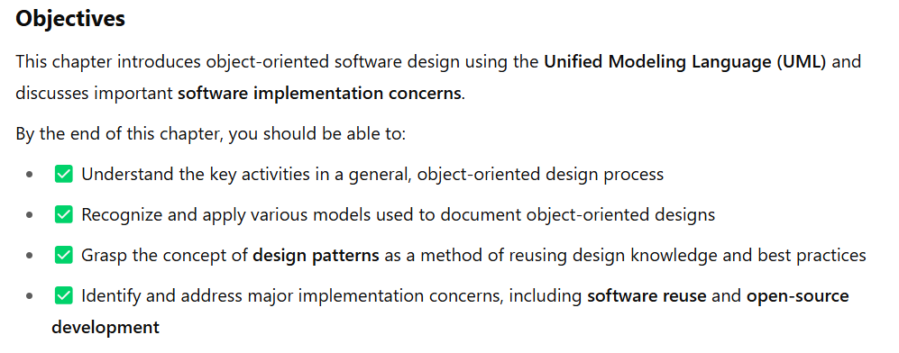

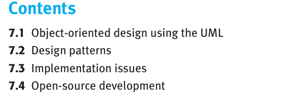

> [!TIP]
>
> ## **Chapter: Software Design and Implementation**
>
> ### **Overview**
>
> - **Software design and implementation** is the phase where the system becomes an **executable product**.
> - For **simple systems**, this may include all software engineering activities.
> - For **large systems**, it's one part of a broader process (includes requirements, verification, validation, etc.).
>
> ------
>
> ### **Key Concepts**
>
> #### 🔧 **Design and Implementation Interleaving**
>
> - These activities are **tightly interwoven**.
> - **Design** involves identifying components and their relationships based on customer requirements.
> - **Implementation** is the realization of the design into code.
>
> #### 🎨 **Nature of Design**
>
> - Can range from formal UML models to informal sketches or mental models.
> - **Always** present, even if not explicitly documented.
> - Design is about how  to solve a problem, so there is always a design process. However, it isn’t always necessary or appropriate to describe the design in detail using the UML or other design  description language.
>
> #### 🧠 **Consider Implementation Early**
>
> - The design should **consider the language and environment**:
>   - UML is helpful for **Java/C#** (OO languages).
>   - Less useful for **Python** or **configuration-based systems**.
> - **Agile methods** often rely on informal designs handled by developers.
>
> ------
>
> ### **Build or Buy Decision**
>
> - A **critical early decision**:
>   - Should you **build** the software or **buy** an off-the-shelf solution?
> - Buying is often:
>   - **Faster** and **cheaper**
>   - Common in domains like **medical systems**
> - <u>**Design focus** then shifts to **configuration** rather than full system modeling.</u>
>
> ------
>
> ### **Reuse-Based Development**
>
> - When reusing software products:
>   - Focus is on **adapting existing systems**
>   - **Object interaction models** may not be created
> - Further discussed in **Chapter 15**
>
> ------
>
> ### **Assumed Background**
>
> - Readers are assumed to have:
>   - Experience with **programming languages** (e.g., Java, Python)
>   - Understanding of **debugging** and **good coding practices**
> - This chapter **does not cover basic programming**.
>
> ------
>
> ### **Chapter Goals**
>
> 1. Show how **system modeling and architecture design** are applied in object-oriented design
> 2. Introduce **implementation concerns** like:
>    - Software **reuse**
>    - **Configuration management**
>    - **Open-source** development
>
> ------
>
> ### **Neutral Platform**
>
> - No specific programming language is favored.
> - **UML** is used for examples to keep content general.


# 7.1 Object - oriented design using UML

> [!TIP]
>
> ### 🧩 **Core Concepts**
>
> 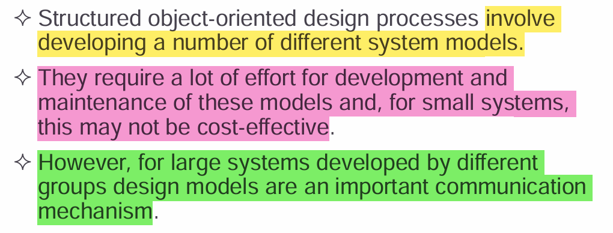
>
> - An **object-oriented system** is built from **interacting objects**.
> - Each object:
>   - Maintains **its own private state**
>   - Offers **operations** (methods) to interact with that state
>   - Hides internal representation (encapsulation)
>
> ------
>
> ### ⚙️ **Object-Oriented Design (OOD)**
>
> - **Objects** are defined by **classes**.
> - Classes describe:
>   - **Attributes** (data/state)
>   - **Methods** (operations)
> - When executed, **objects are instantiated** from these class definitions.
> - Objects:
>   - Can be **understood/modified independently**
>   - Are **loosely coupled**, reducing system-wide impact when changes occur
>   - Often map to **real-world entities**, making systems easier to understand and maintain
>
> ------
>
> ### 🛠️ **OOD Process Steps**
>
> To move from a **concept** to a **detailed object-oriented design**, follow these general steps:
>
> > 1. **Define the system context and interactions** 
> >     – Identify the system’s boundaries and its external interactions.
> > 2. **Design the system architecture**
> >     – Establish the high-level structure and components.
> > 3. **Identify principal objects**
> >     – Determine the main classes/entities in the system.
> > 4. **Develop design models**
> >     – Use tools like **UML** to visualize classes, relationships, interactions, etc.
> > 5. **Specify interfaces**
> >     – Define how objects communicate (method signatures, parameters, etc.).
>
> ------
>
> ### 💡 **Nature of Design Work**
>
> - Design is **creative** and **iterative**:
>   - It’s **not strictly linear**—expect backtracking and revisiting earlier decisions.
>   - Sometimes details are explored early; other times, they’re deferred.
>   - **UML and other notations** can be:
>     - Used **formally** for clarity and documentation
>     - Used **informally** for brainstorming and collaboration+
>
> example
>
>  I explain object-oriented software design by developing a design for part of the  embedded software for the wilderness weather station that I introduced in Chapter 1.  
>
> Wilderness weather stations are deployed in remote areas. Each weather station  records local weather information and periodically transfers this to a weather information system, using a satellite link
>
> 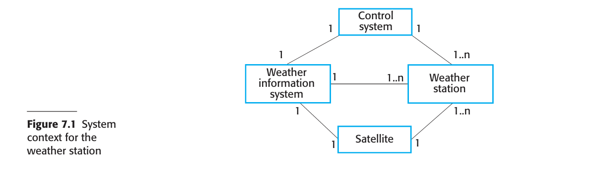


## 7.1.1  System context and interactions

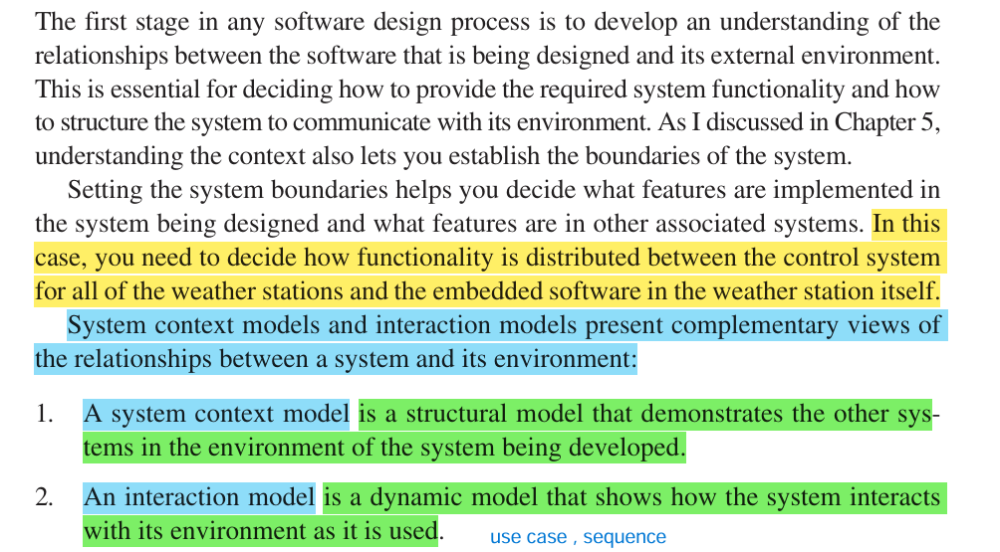

#### system context model


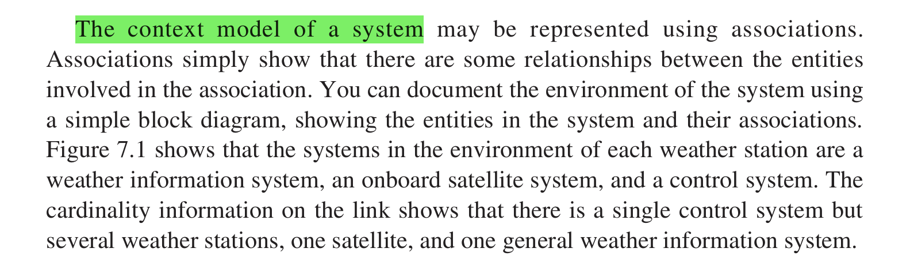


#### Interactional model

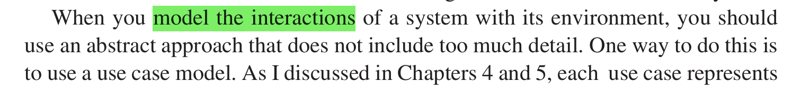

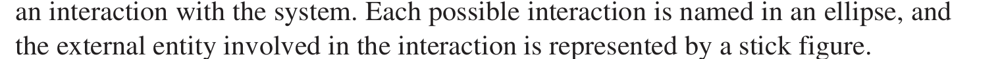

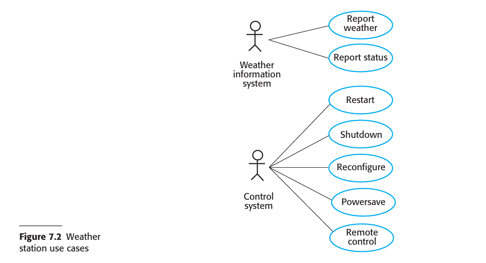 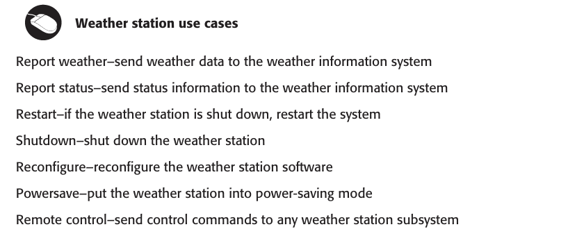


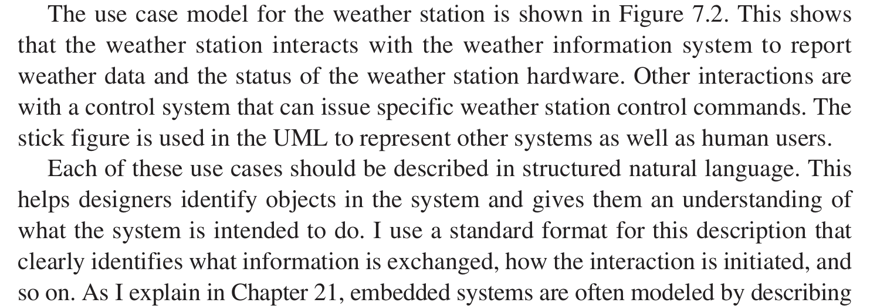

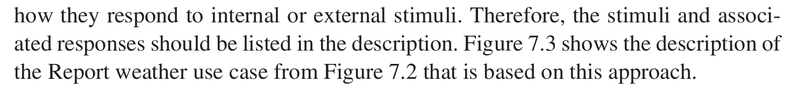

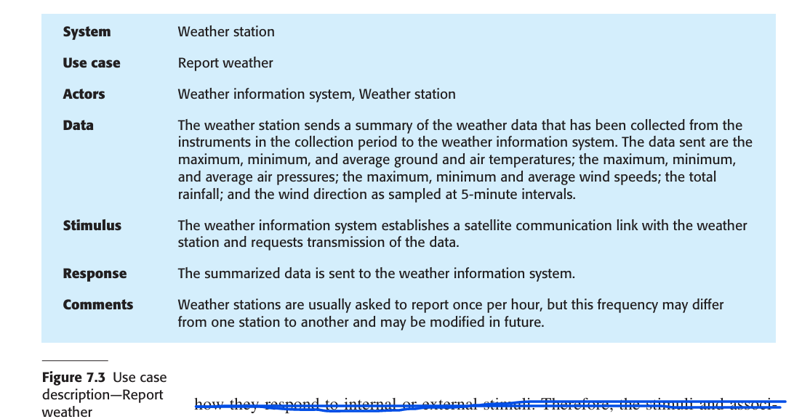

## 7.1.2 Architectural design

> To build the architecture we only need context and interactional models, other models are developed in later phases.

-  Once the interactions between the software system and the system’s environment  have been defined, you use this information as a basis for designing the system architecture. 
- Of course, you need to combine this knowledge with your general knowledge of the principles of architectural design and with more detailed domain  knowledge. 
- You identify the major components that make up the system and their  interactions. You may then design the system organization using an architectural  pattern such as a layered or client–server model.

> [!WARNING]
>
> The high-level architectural design for the <u>weather station</u> software is shown in  Figure 7.4. 
>
> 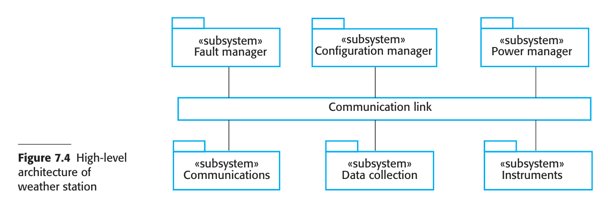
>
> - The weather station is composed of independent subsystems that  communicate by broadcasting messages on a common infrastructure, shown as Communication link in  Figure 7.4.
> -  Each subsystem listens for messages on that infrastructure and picks up the  messages that are intended for them. ==This “listener model” is a commonly used architectural style for distributed systems.==
> -  When the communications subsystem receives a control command, such as shut down, the command is picked up by each of the other subsystems, which then shut  themselves down in the correct way. 
> - ==The key benefit of this architecture is that it is  easy to support different configurations of subsystems because the sender of a message does not need to address the message to a particular subsystem.==
>
> 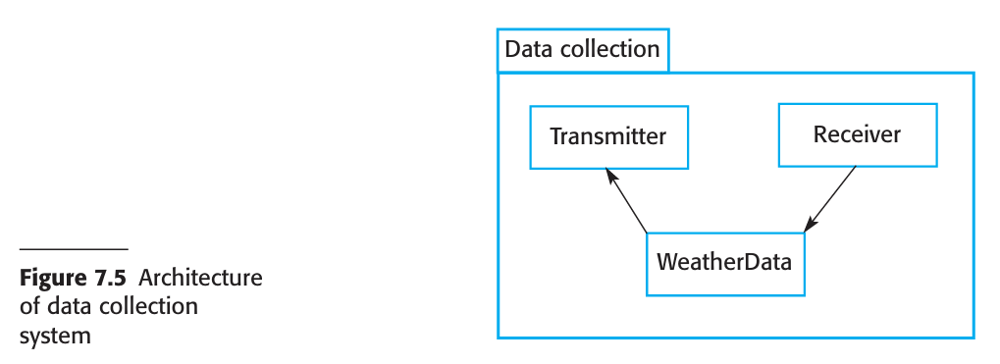
>
> -  Figure 7.5 shows the architecture of the data collection subsystem, which is included  in Figure 7.4. The Transmitter and Receiver objects are concerned with managing  communications, and the WeatherData object encapsulates the information that is collected from the instruments and transmitted to the weather information system. This  arrangement follows the producer–consumer pattern, discussed in Chapter 21.
>
> 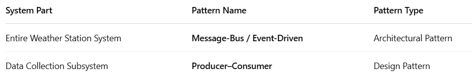

 

## 7.1.3 Object class identification

 By this stage in the design process, you should have some ideas about the essential  objects in the system that you are designing. As your understanding of the design  develops, you refine these ideas about the system objects. 

The use case description  helps to identify objects and operations in the system. <u>From the description of the  Report weather use case, it is obvious that you will need to implement objects representing the instruments that collect weather data and an object representing the  summary of the weather data.</u> 

You also usually need a high-level system object or  objects that encapsulate the system interactions defined in the use cases. With these  objects in mind, you can start to identify the general object classes in the system. 

As object-oriented design evolved in the 1980s, various ways of identifying  object classes in object-oriented systems were suggested

#### 1. Grammatical analysis

#### 2. Tangible and conceptual entities

#### 3. Scenario based analysis

> [!NOTE]
>
> ## 🔍 **Methods for Identifying Object Classes in OO Design**
>
> ### **1. Grammatical Analysis**
>
> **(Abbott, 1983)**
>
> - Based on analyzing **natural language descriptions** of system requirements.
> - **Nouns** → Candidate **classes** or **attributes**
> - **Verbs** → Candidate **methods** or **operations**
>
> #### ✅ Example:
>
> From the sentence *"The manager approves leave requests."*
>
> - **Nouns**: manager, leave, request → candidate classes
> - **Verbs**: approves → candidate operation (e.g., `approveRequest()`)
>
> > 🧠 Use Case: Best for early requirement documents written in plain English.
>
> ------
>
> ### **2. Tangible & Conceptual Entities**
>
> **(Wirfs-Brock, Wilkerson, and Weiner, 1990)**
>
> - Identify objects based on **domain-specific concepts**.
> - These include:
>   - **Tangible entities** (e.g., aircraft, employees)
>   - **Roles** (e.g., manager, student)
>   - **Events** (e.g., login, request)
>   - **Interactions** (e.g., meetings, messages)
>   - **Locations** (e.g., office, server room)
>   - **Organizational units** (e.g., departments, companies)
>
> > 🧠 Use Case: Great for domain-driven design and aligning software closely with real-world systems.
>
> ------
>
> ### **3. Scenario-Based Analysis**
>
> **(Beck & Cunningham, 1989)**
>
> - Analyze **user interaction scenarios** (often written as use cases).
> - For each scenario, extract:
>   - **Objects** (participants in the scenario)
>   - **Attributes** (data held by the objects)
>   - **Operations** (actions the objects perform)
>
> #### ✅ Example:
>
> Scenario: A customer places an order online.
>
> - Objects: customer, order, shopping cart, product
> - Attributes: customer name, order ID
> - Operations: addProduct(), confirmOrder(), etc.
>
> > 🧠 Use Case: Common in **agile development** and **use-case-driven modeling**.
>
> ------
>
> ### 🧠 Summary Table
>
> 
>
> | Method                   | Key Idea                                      | Best For                               |
> | ------------------------ | --------------------------------------------- | -------------------------------------- |
> | **Grammatical Analysis** | Use nouns/verbs in text to find classes       | Early requirement docs                 |
> | **Tangible Entities**    | Identify real-world or domain-specific things | Domain-driven and conceptual design    |
> | **Scenario-Based**       | Extract from system usage scenarios           | Agile modeling, use-case driven design |
>
> ------
>
> 
>
> ## 🔧 **Practical Approach to Discovering Object Classes**
>
> ### ✅ 1. **Use Multiple Knowledge Sources**
>
> No single technique is sufficient—effective class identification pulls from:
>
> - **Grammatical analysis** (from natural language descriptions)
> - **Domain knowledge** (understanding real-world entities)
> - **Scenarios and use cases** (user stories and workflows)
> - **Stakeholder input** (conversations with users, SMEs)
> - **Legacy systems** (looking at how similar problems were solved)
>
> ------
>
> ### ✅ 2. **Start with What You Know**
>
> - Use **initial classes, attributes, and operations** identified from informal requirements.
> - These become the **seed elements** of your object model.
>
> > Think of this as a **first draft**—it gets you going, but it will evolve.
>
> ------
>
> ### ✅ 3. **Refine and Expand Through Domain Analysis**
>
> - Domain concepts may reveal hidden complexity:
>   - A “User” might later split into “Admin,” “Guest,” and “RegisteredUser.”
> - **Scenarios** reveal additional responsibilities and operations (e.g., edge cases, exception flows).
>
> ------
>
> ### ✅ 4. **Don’t Forget Implementation Objects**
>
> - These aren’t tied to domain entities, but are essential for making the system work.
>
> Examples:
>
> 
>
> | Purpose                | Example Implementation Object   |
> | ---------------------- | ------------------------------- |
> | **Searching**          | `SearchService`, `FilterEngine` |
> | **Validation**         | `Validator`, `RulesEngine`      |
> | **Formatting/Parsing** | `Formatter`, `Parser`           |
> | **Utility Functions**  | `DateHelper`, `StringUtils`     |
>
> > 🧠 These are often **internal-use classes**, but they’re critical to architecture and maintainability.
>
> ------
>
> ### 🎯 Summary
>
> 
>
> | Step                       | Goal                                              |
> | -------------------------- | ------------------------------------------------- |
> | Use informal descriptions  | Identify candidate classes/operations             |
> | Apply domain knowledge     | Refine based on real-world entities and behaviors |
> | Analyze scenarios          | Discover interactions, responsibilities           |
> | Add implementation objects | Support system-level functionality                |

ex: 

-  In the wilderness weather station, <u>object identification is based on the tangible hardware in the system(2^nd^ method)</u>.

-  I don’t have space to include all the system objects here, but  I have shown five object classes in Figure 7.6. 

  - The Ground thermometer,  Anemometer, and Barometer objects are application domain objects,
  -  and the  WeatherStation and WeatherData objects have been identified from the system description and the scenario (use case) description

  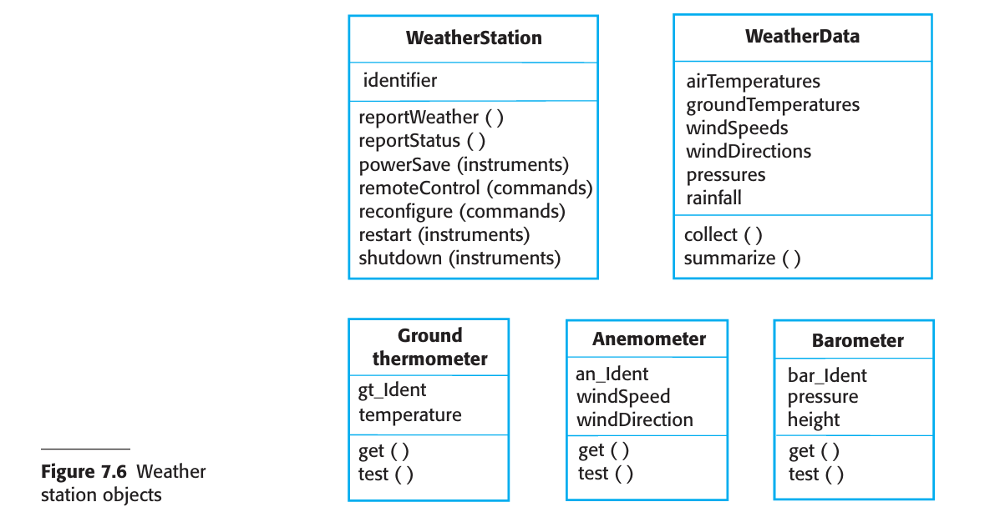

  > 1. The WeatherStation object class provides the basic interface of the weather station with its environment. Its operations are based on the interactions shown in  Figure 7.2. I use a single object class, and it includes all of these interactions.  Alternatively, you could design the system interface as several different classes,  with one class per interaction.
  > 2. The WeatherData object class is responsible for processing the report weather  command. It sends the summarized data from the weather station instruments to  the weather information system.
  > 3. The Ground thermometer, Anemometer, and Barometer object classes are directly  related to instruments in the system. They reflect tangible hardware entities in the  system and the operations are concerned with controlling that hardware. These  objects operate autonomously to collect data at the specified frequency and store the  collected data locally. This data is delivered to the WeatherData object on request.
  >
  > 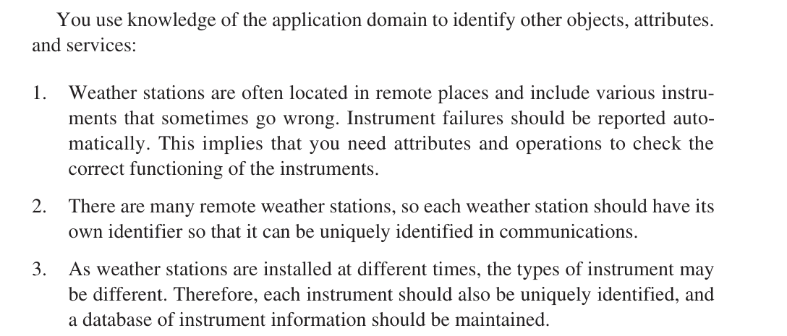
  >
  > - At this stage in the design process, you should focus on the objects themselves, without thinking about how these objects might be implemented. 
  > - Once you have identified  the objects, you then refine the object design. You look for common features and then  design the inheritance hierarchy for the system. For example, you may identify an  Instrument superclass, which defines the common features of all instruments, such as an  identifier, and get and test operations. You may also add new attributes and operations  to the superclass, such as an attribute that records how often data should be collected.


## 7.1.4 Design models

-  Design or system models, as I discussed in Chapter 5, show the objects or object classes  in a system. They also show the associations and relationships between these entities.

- An important step in the design process, therefore, is to decide on the design models  that you need and the level of detail required in these models. This depends on the type  of system that is being developed.
-  A sequential data-processing system is quite different  from an embedded real-time system, so you need to use different types of design models.  The UML supports 13 different types of models, but, as I discussed in Chapter 5, many  of these models are not widely used. Minimizing the number of models that are produced  reduces the costs of the design and the time required to complete the design process.

> [!TIP]
>
> ## 🧱 **Purpose of Design (or System) Models**
>
> - They **bridge the gap** between *system requirements* and *implementation*.
> - Should be:
>   - **Abstract enough** to highlight core relationships and logic.
>   - **Detailed enough** to guide programmers in making decisions.
>
> ------
>
> ## 🧰 **How Much Detail?**
>
> Depends on:
>
> - **Development process** (Agile vs. Plan-based)
> - **Team structure** (collocated vs. distributed)
> - **System type** (e.g., real-time embedded vs. data-processing)
>
> 
>
> | Process Type      | Design Model Detail         |
> | ----------------- | --------------------------- |
> | Agile             | Minimal, sketch-level       |
> | Plan-based        | Precise, detailed models    |
> | Collocated teams  | Can rely on discussions     |
> | Distributed teams | Need accurate documentation |
>
> ------
>
> ## 📐 **Two Main UML Model Types You Should Use**
>
>  When you use the UML to develop a design, you should develop two kinds of  design models:
>
> ### 1. **Structural Models**
>
>  which describe the static structure of the system using object  classes and their relationships. Important relationships that may be documented  at this stage are generalization (inheritance) relationships, uses/used-by  relationships, and composition relationships.
>
> - Focus: **Static structure**
> - What they show:
>   - Object classes
>   - Relationships:
>     - **Inheritance** (generalization)
>     - **Uses/used-by**
>     - **Composition** (whole-part)
>
> > Represented using **UML class diagrams**
>
> ------
>
> ### 2. **Dynamic Models**
>
>  which describe the dynamic structure of the system and show  the expected runtime interactions between the system objects. Interactions that  may be documented include the sequence of service requests made by objects  and the state changes triggered by these object interactions.
>
> - Focus: **Runtime behavior**
> - What they show:
>   - Object interactions
>   - Event responses
>   - State transitions
> - > Represented using **UML activity, use case,state, sequence diagrams **
>
> ------
>
> ## 🧩 **Three Most Useful UML Models for Detailing a Design**
>
>  I think three UML model types are particularly useful for adding detail to use  case and architectural models:
>
> Two types of UML diagrams condition is satisfied -> Structural, Dynamic
>
> | Model Type              | Description                                                  | Structural or Dynamic? |
> | ----------------------- | ------------------------------------------------------------ | ---------------------- |
> | **Subsystem Model**     | Groups related objects into subsystems.                                                               These are represented using a form of class diagram with each subsystem  shown as a package with enclosed objects. | Structural             |
> | **Sequence Model**      | Shows how objects interact over time in a use case. Uses lifelines and messages. These are  represented using a UML sequence or a collaboration diagram. | Dynamic                |
> | **State Machine Model** | Shows object state changes in response to events.                                                These are represented in the UML using state diagrams | Dynamic                |
>
> ------
>
> ## 🧠 Summary Tips
>
> - **Decide early** which models to use and how detailed they need to be.
> - **Don’t model everything**—just what adds value for communication and understanding.
> - Think in terms of **who will use the model** (designers, developers, testers).


#### <u>Subsystem model</u>

-  A subsystem model is a useful static model that shows how a design is organized into  logically related groups of objects. I have already shown this type of model in Figure 7.4  to present the subsystems in the weather mapping system. As well as  subsystem models,  you may also design detailed object models, showing the objects in the systems and their  associations (inheritance, generalization, aggregation, etc.). However, there is a danger  in doing too much modeling. You should not make detailed decisions about the implementation that are really best left until the system is  implemented

  


#### <u>Sequence Model</u>

-  Sequence models (sequence diagrams are drawn for a use case) are dynamic models that describe, for each mode of interaction,  the sequence of object interactions that take place. When documenting a design, you  should produce a sequence model for each significant interaction. If you have developed a use case model, then there should be a sequence model for each use case that  you have identified. 

  - Figure 7.7 is an example of a sequence model, shown as a UML sequence  diagram. This diagram shows the sequence of interactions that take place when an  external system requests the summarized data from the weather station.

    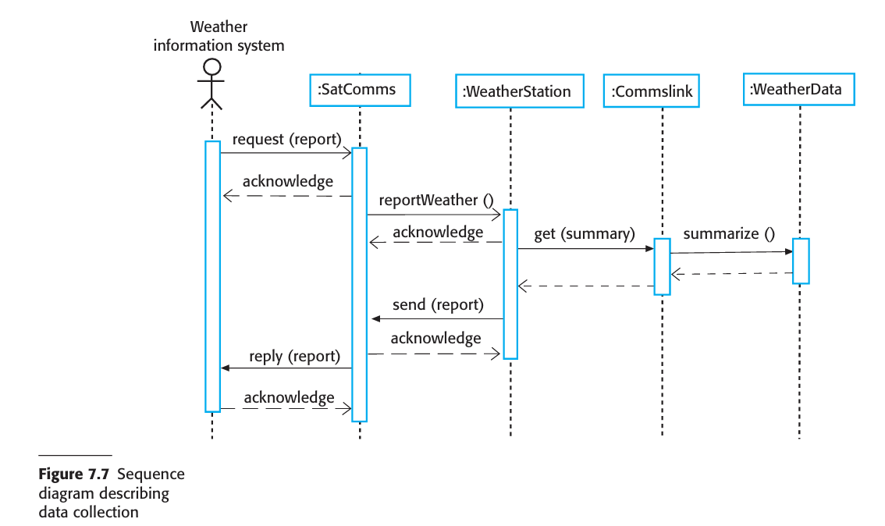

    - The stick arrowhead on the sent message indicates that the external system  does not wait for a reply but can carry on with other processing.
    - WeatherStation sends a message to a Commslink object to summarize the  weather data. In this case, the squared-off style of arrowhead indicates that the  instance of the WeatherStation object class waits for a reply.

  - The **SatComms** and **WeatherStation** objects may be implemented as concurrent  processes, whose execution can be suspended and resumed. The **SatComms** object  instance listens for messages from the external system, decodes these messages, and  initiates weather station operations.

#### <u>State Model</u>

-  Sequence diagrams are used to model the combined behavior of a group of objects,  but you may also want to summarize the behavior of an object or a subsystem in response  to messages and events. To do this, you can use a state machine model that shows how  the object instance changes state depending on the messages that it receives. As I discuss  in Chapter 5, the UML includes state diagrams to describe state machine models.

- Figure 7.8 is a state diagram for the weather station system that shows how it  responds to requests for various services.

  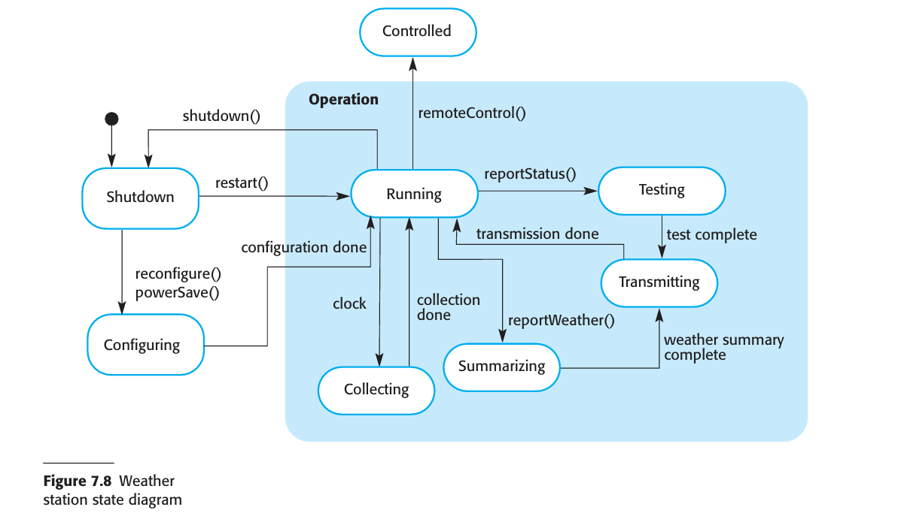

  1. If the system state is Shutdown, then it can respond to a restart(), a reconfigure()  or a powerSave() message. The unlabeled arrow with the black blob indicates  that the Shutdown state is the initial state. A restart() message causes a transition  to normal operation. Both the powerSave() and reconfigure() messages cause a  transition to a state in which the system reconfigures itself. The state diagram  shows that reconfiguration is allowed only if the system has been shut down.
  2. In the Running state, the system expects further messages. If a shutdown() mes sage is received, the object returns to the shutdown state. 
  3.  If a reportWeather() message is received, the system moves to the Summarizing  state. When the summary is complete, the system moves to a Transmitting state where  the information is transmitted to the remote system. It then returns to the Running state.
  4.  If a signal from the clock is received, the system moves to the Collecting state,  where it collects data from the instruments. Each instrument is instructed in turn  to collect its data from the associated sensors. 
  5.  If a remoteControl() message is received, the system moves to a controlled state  in which it responds to a different set of messages from the remote control room.  These are not shown on this diagram.

  State diagrams are useful high-level models of a system or an object’s operation.  However, you don’t need a state diagram for all of the objects in the system. Many  system objects in a system are simple, and their operation can be easily described  without a state model.

  

## 7.1.5 Interface specification


> [!TIP]
>
> Thought for a couple of seconds
>
> Here’s a concise breakdown of **Interface Specification** (Section 7.1.5) and how it fits into your UML-based design process:
>
> ------
>
> ## 🎯 Purpose of Interface Specification
>
> - **Decouple components** so they can be designed and implemented in parallel.
> - Once an interface is agreed, callers can rely on it even if the implementation changes.
>
> ------
>
> ## 🔧 What to Specify in an Interface
>
> 1. **Operation Signatures**
>    - Method names, parameter types, return types.
>    - No attributes/data representations—those stay hidden.
> 2. **Semantics**
>    - Use **OCL** (Object Constraint Language) to formally define pre‑/post‑conditions, invariants, etc.
>    - Keeps behavior precise without leaking implementation details.
>
> ------
>
> ## 🛠️ UML Notation for Interfaces
>
> - Drawn like a class box **without** an attribute section.
> - Stereotype it with «interface» above the name.
> - List only the operations (signatures) in the compartment.
>
> ```plantuml
> interface «interface» IWeatherReport {
>     + generateReport(): WeatherReport
>     + reportStatus(): Status
> }
> ```
>
> ------
>
> ## 🔄 Hiding Representation, Exposing Behavior
>
> - **No attributes** in interface: you can swap implementations (e.g., array ↔ list) without breaking clients.
> - Always expose **methods** for any data access or update.
>
> ------
>
> ## 🔀 Multiple Views & Group Interfaces
>
> - A single class can **implement** several interfaces, each catering to a different viewpoint.
> - Conversely, you can define an interface that’s implemented by a **group of classes**, presenting a unified façade.
>
> ------
>
> ## 📐 Weather Station Example (Figure 7.9)
>
> | Interface Name             | Purpose                             | Operations Exposed                              |
> | -------------------------- | ----------------------------------- | ----------------------------------------------- |
> | «interface» IReporting     | Reporting weather & hardware status | + reportWeather(): Data+ reportStatus(): Status |
> | «interface» IRemoteControl | Sending control commands            | + remoteControl(cmd: String): void              |
>
> - **Mapping:**
>   - `IReporting` methods map 1:1 to `WeatherStation.generateWeatherReport()` and `WeatherStation.reportHardwareStatus()`.
>   - `IRemoteControl` is a single `remoteControl(String cmd)` that encodes four sub‑commands internally.
>
> ------
>
> ### 🔍 Next Steps
>
> - **Draft your interfaces** in UML—identify who needs to call what.
> - If you want, I can help you write sample OCL constraints for one of these operations, or sketch the actual UML interface boxes for your system. Let me know!

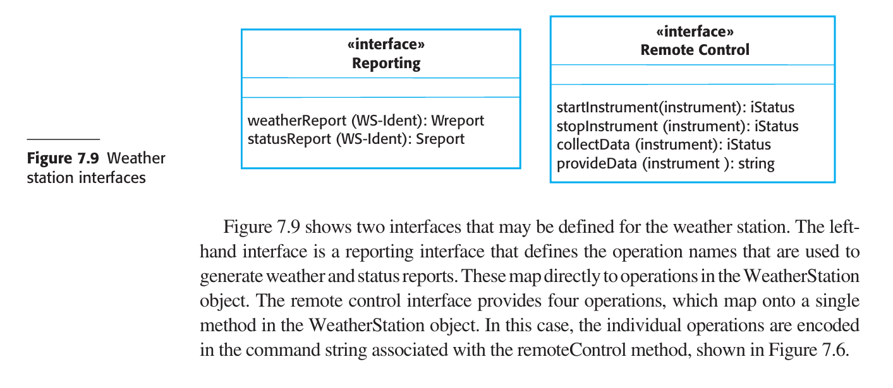


# 7.2 Design patterns

# 7.3 Implementation issues

# 7.4 Open - source development
