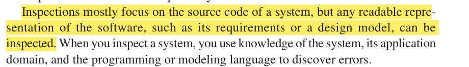

# Software Testing


# Basics

> [!IMPORTANT]
>
> ## **1. Introduction to Software Testing**
>
> Testing is intended to show that a program does what it is intended to do and to  discover program defects before it is put into use. Testing is aimed at ensuring that a program:
>
> 1. **Does what it is intended to do** (validation)
> 2. **Discovers program defects** before it is put into use (defect testing)
>
> Testing involves executing the software with artificial data, checking the results for errors, anomalies, or information about non-functional attributes. 
>
> 
>
> 
>
> ## **2. Objectives of Software Testing**
>
> - **Demonstrate to the developer and customer that the software meets its requirements** (Validation Testing)
> - **Find situations where the software behaves incorrectly, undesirably, or does not conform to its specification** (Defect Testing)
>
> 
>
> ## **3. Types of Testing**
>
> #### **3.1 Validation Testing**
>
> 
>
> - **Purpose:** Show the system meets its requirements using test cases that reflect expected use.
> - **Test Case Design:** Based on normal, expected inputs.
> - **Outcome:** Demonstrates correct operation for intended scenarios.
> - **Example:** For every requirement, there should be at least one corresponding test case1.
>
> #### **3.2 Defect Testing**
>
> 
>
> - **Purpose:** Expose faults or bugs using test cases that may be obscure or abnormal.
> - **Test Case Design:** Based on unusual, boundary, or invalid inputs.
> - **Outcome:** Reveals incorrect, undesirable, or unspecified behavior.
> - **Example:** Tests that cause system crashes, incorrect computations, or data corruption1.
>
> ​                                 
>
> **Note:** There is no strict boundary between validation and defect testing. Validation testing may reveal defects, and defect testing may show the system meets requirements.
>
> ------
>
> ## **4. Verification and Validation (V&V)**
>
> #### **4.1 Definitions**
>
> | Term         | Question Answered                  | Focus                       | Methods                                |
> | ------------ | ---------------------------------- | --------------------------- | -------------------------------------- |
> | Verification | Are we building the product right? | accordance to specification | Reviews, inspections, static analysis  |
> | Validation   | Are we building the right product? | Meeting user/customer needs | Dynamic testing, user acceptance tests |
>
> - **Verification:** *Static process*; <u>checks if the software meets its stated requirements and design specifications</u>( checking that the software meets its stated  functional and non-functional requirements). Involves activities like inspections and reviews, and ==does not require code execution==.
>
>   
>
>   
>
>   > #### software inspections and reviews
>   >
>   > -  As well as software testing, the verification and validation process may involve  software inspections and reviews.
>   >
>   > -  Inspections and reviews analyze and check the  system requirements, design models, the program source code, and even proposed  system tests.
>   >
>   > -  <u>These are “static” V & V techniques in which you don’t need to execute  the software to verify it.</u> -> Verification technique
>   >
>   > - Figure 8.2 shows that software inspections and testing sup port V & V at different stages in the software process. The arrows indicate the stages  in the process where the techniques may be used.
>   >
>   >   
>   >
>   >   
>   >
>   >   #### Advantages of software inspection over dynamic testing
>   >
>   >   They complement dynamic testing and offer unique benefits in defect detection and quality assurance.
>   >
>   >   1. **No Error Masking**
>   >      - Testing can obscure errors: An initial error may produce unexpected outputs, making it difficult to distinguish subsequent errors from side effects.
>   >      - Inspections avoid this by analyzing code/documentation statically, enabling simultaneous discovery of multiple defects in a single session.
>   >   2. **Cost-Effective for Incomplete Systems**
>   >      - Inspections require no test harnesses or executable code, reducing overhead for partially developed systems.
>   >      - Testing incomplete systems often demands additional infrastructure (e.g., stubs, drivers), increasing development costs.
>   >   3. **Broader Quality Assessment**
>   >      - Inspections evaluate compliance with standards, portability, maintainability, and algorithmic efficiency.
>   >      - They identify poor programming practices (e.g., inefficient algorithms, unclear documentation) that testing alone cannot address
>   >
>   > 
>   >
>   > 
>
>   
>
>   
>
> - **Validation:** *Dynamic process*; <u>ensures the software meets the customer's expectations and actual needs</u>, <u>going beyond the specification</u>. ==Involves executing the software and checking its behavior==. Validation is a more general process. Validation is  essential because, as I discussed in Chapter 4, statements of requirements do not  always reflect the real wishes or needs of system customers and users.
>
>   
>   
>
> #### **4.2 goals of V&V**
>
> - Both V&V processes aim to establish confidence that the software is **<u>fit for purpose</u>**.
>
> - The required level of confidence depends on:
>   - **Software purpose** (e.g., safety-critical vs. prototype)
>   
>     
>   
>   - **User expectations**
>   
>     
>   
>     
>   
>   - **Market environment**
>   
>     
>
> 


 In this chapter, I focus  on testing and testing processes. I discuss reviews and inspections in more detail in Chapter 24 (Quality  Management). 


# Traditional testing process

-  Figure 8.3 is an abstract model of the traditional testing process, as <u>used in plan driven development.</u> 

  


# **Stages of Testing**

Typically, a commercial software system has to go through three stages of testing

1. **Development Testing**

   - Conducted by developers during system creation.
   - Includes unit, component, and system testing.
   - Primarily focuses on defect testing.

2. **Release Testing**

   - Performed by a separate team before the system is released.
   - Aims to validate the system against requirements of the system stakeholders.
   - Often uses black-box (functional) testing.

3. **User Testing**

   - Conducted by actual <u>users in their environment</u>.

   - Includes alpha, beta, and acceptance testing.

   - Essential for uncovering issues not found in controlled environments.

     


# 8.1. Development testing

-  Development testing includes all testing activities that are carried out by the team developing the system. The tester of the software is usually the programmer who  developed that software. 

- Some development processes use programmer/tester pairs  where each programmer has an associated tester who  develops tests and assists with the testing process. 

- For critical systems, a more formal process may be used, with a separate testing group within the development team.  This group is responsible for developing tests and maintaining detailed records of  test results.

  

## Stages of dev testing

> **1. Unit Testing**
>
> - **Focus:** Testing individual units (methods, classes) in isolation.
>
> - **Example:**
>
>   - *Function:* A method calculating the sum of two numbers.
>
>   ```python
>   def add(a, b):  
>       return a + b  
>   ```
>
>   - *Test Cases:*
>     - `add(2, 3)` → 5 (valid input).
>     - `add(-1, 5)` → 4 (negative numbers).
>     - `add(0, 0)` → 0 (edge case).
>
> **2. Component Testing**
>
> - **Focus:** where several individual units are integrated to create composite components. Component testing should <u>focus on testing the component  interfaces</u> that provide access to the component functions.
> - **Example:**
>   - *Component:* User login module combining input validation and database checks.
>   - *Test Cases:*
>     - Valid username/password → Success message.
>     - Invalid password → Error message.
>     - Empty input → Prompt to fill fields.
>   - *Interface Check:* Ensure the validator correctly passes data to the database component.
>
> **3. System Testing**
>
> - **Focus:** where some or all of the components in a system are integrated  and the system is tested as a whole. System testing should focus on testing com ponent interactions.
> - **Example:**
>   - *System:* E-commerce checkout process.
>   - *Test Scenario:*
>     1. User adds items to cart.
>     2. Enters payment details.
>     3. Completes purchase.
>   - *Check:* Inventory updates, payment confirmation email sent, order history updated.
>
> 


### 1.Unit testing


# 8.2. Test-driven development

# 8.3. Release testing

# 8.4. User testing
